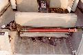
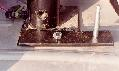
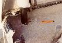
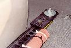
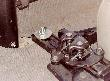

# Hi-Lift/Jack-all Mount

#### by [Terry Morris](mailto:tlm@cyberramp.net)

Following is the procedure that I created to mount a 4 ft high lift jack
directly behind the rear seat perched on the wheel wells.  Most of this
is common sense and you may wish to modify to your wishes...however this
gives you the idea.  The nice thing about this is that is "rollover
proof" and it out of the elements and occupies space otherwise
wasted.

## Materials list

- 2-metal flat stock (scrap from local welding shop) 6"L x 1.5"W x .25" deep

- 2- 1/4" x 3" hex head bolts

- 2- 1/4" wingnuts

- 2- 2" fender washers (with 1/4" holes).  You may want a few extra.

- 2- 1" or so washers (with 1/4 holes).  These will nest "inside" the jack
when on it's      right under the 2" washers.  You may want some extra's
here

- 2- grade 5 or better hex head bolts 1/4" longer than the inside roll bar bolt
(take it with     you to the hardware store to get the right pitch.

Extra's:  I drilled a hole through my "add-a-trunk" and ran a hex head
bolt through it with a wing nut on the inside.  I could then lock the
gate and therefore secure the jack.

## Installation

My objective was to get the jack as close to
the rear seat as possible.  Here is what I did:

Mark flat stock with f/r markings (so you can follow me).  Drill a 1/4"
hole (centered) about 3" from the front of each piece of flat stock.
This will be where you reinstall the longer roll bar bolt.  Drill
another 1/4" hole (centered) about 1" from the front side for the 3"
hex head bolts.

Run the the 3" hex head bolts through the front holes of the flat stock
and install them so the head is down.  Use the hex head bolts to secure
the flat stock to the roll bar with the head up.  The bolt going into
the rollbar holds the bolt head tight against
the fender (you may want to put a thin piece of rubber to prevent
squeaks).  Replace the carpet and cut a small hole to allow the
bolt to protrude through the carpet.

Take the base off the jack and install the jack with the
handle toward the rear of the Jeep (the top of jack will be on passenger
side).  Put the drivers side bolt through the bottom of the jack and the
passenger side bolt through the top of the jack.  You'll see how neat it
mates up when you do it.  Slide the small washers down first, then slide
on a large washer, then screw down the wing nut.

You're finished!  I've put rubber on the handle and zip tied it to
keep it quiet.

