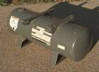
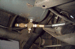
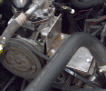
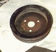
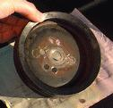
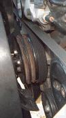
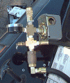
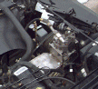

# On-Board Air for Jeeps Using the York Compressor

#### by [Obi-Wan](http://www.jedi.com/obiwan/jeep/yorkair.html)

One of the most time-honored rituals in four-wheeling is the airing
down of your tires before you hit the trail.  The problem is that
you then need to refill them to street pressure before you hit the
highway.  The obvious solution is to carry an air tank or air compressor
with you on the trail.  There are several ways to do this:

-  Carry a pre-filled air tank with you that has enough capacity to
	fill all four tires.  This gives you a limited air supply, and
	doesn't allow you to help out your neighbors who need air.

-  Carry a $15 compressor powered by your lighter jack.  This is cheap
	and gives you unlimited air, but you have to wait forever.  I
	have such a compressor.  It's great for bikes and balls, but
	it only puts about 1 psi per minute into my 225/75R15's.

-  If you have
	ARB air lockers, you can use the small compressor that powers
	those to fill your tires.  It's a whole lot better than the above
	option, but it's still slow, noisy, only puts out about
	90 psi, and costs $200.

-  Companies like Curry and Ready-Air sell electric compressors that
	you mount in your engine compartment.  These often are setup to
	fill auxiliary air tanks mounted somewhere on the vehicle.
	The Quick Air 2 boasts 2.2 cfm at 105 psi and runs about
	$250.

-  The York-style A/C compressors used by AMC, Ford, and Volvo in the
	'70's can be used as engine-driven air compressors.  That's the
	setup that I'm using on my YJ.  Not only will it fill tires,
	but it also keeps up with most smaller air tools.

## The Tank

You really should have a tank for any good onboard air setup.  This
ensures that you still have air if your engine dies, and it lets you
run things like air tools that suck more volume than your compressor
can put out.

Some people weld shut the ends of their tube bumpers, nerf bars, or
roll cages and tap a hole to mount the air fittings.  For example,
a 36" long, 3" diameter tube will hold 1.1 gallons of air.  This is
a great idea, if you have such things on your vehicle.  I don't (yet).
I opted for a used 6"x19", 2-gallon tank from an old portable air
compressor rated at 125 psi.  I picked this up at a local air compressor
repair shop for $30.  It even came with the necessary brackets already
welded onto it, as well as two threaded holes containing a drain plug,
quick disconnect fitting, and 150 psi pop-off safety valve.  I just had
to drill the mounting holes and cut off any brackets I didn't need.

The next trick is tank placement.  Some people put the tank inside
the vehicle, but then you have to run the air lines through the
firewall to reach the compressor.  It's also a safety hazard if the
tank gets over-pressurized or dented and explodes.  In a small vehicle
like my YJ, inside space is at a premium, so I didn't want to waste
it with a permanently-mounted air tank.

That left three good spots that I could find on my YJ:

-  Just behind and to the right (passenger side) of the radiator,
	in front of the fender well.

-  Behind the right fender well, underneath the battery tray.

-  Under the body tub, above, in front of, and parallel to the
	rear axle.

Each spot is a different shape.  The best choice depends on the shape
of your tank and the amount of other stuff in your engine compartment.
I chose to mount my tank by the rear axle.  The maximum diameter of
a tank in this position is 6" if you want to avoid hitting it with
your pinion yoke.

When mounting your tank, it's important to have an outlet at the
lowest point on the tank so you can drain moisture from it periodically.
Regardless of what filters you have on the line, unless you live in a
zero-humidity environment, water *will* condense on the inside of
the tank when it depressurizes.

When I mounted my tank, I used a single hole on the bottom "side" of
the tank for both input and output.  I simply used a four-way cross
connector that had the top connected to the bottom of the tank, the
hose to the compressor coming out one side of the cross, a drain plug
on the bottom of the cross, and a quick-disconnect fitting on the other
side.  The quick disconnect is a bit more difficult to reach than I'd
originally envisioned, so I may drill a hole in my tub and move it
inside the cab someday.  To keep the inside of the quick disconnect
clean, I capped off a male disconnect fitting and keep it plugged into
the female end when not in use.  I zip-tied the hose to the brake and
fuel lines running along the inside of the frame rail and up into the
engine compartment.  The hose then ran along a lip on the bottom of the
firewall just above the bellhousing (I drilled a hole in this ledge and
zip-tied the hose to it to ensure it wouldn't fall off and lie on
anything hot.  I coiled the extra foot or two of hose up under the
battery tray, and then ran the end of it under the alternator to the
front of the passenger fenderwell where the rest of the air fittings
were located.  This requires about 12' of hose; I picked up 15' of 1/4"
hose for $7 from the local surplus center.

## The Compressor

### Identification

Most A/C compressors lubricate themselves with the freon that flows
through the A/C system.  In order to use these compressors for pumping
air, you need to have an external oiler feeding oil into the intake
hose and a filter to remove the oil from the output hose.  Certain
York-style compressors (the big, boxy, vertical kind) used an internal
oil reservoir for lubrication, which makes them ideal for use as
stand-alone air compressors.  These compressors were commonly used on
AMCs, Fords, and (I hear) Volvos in the '70's and early '80's.

Therold Enterprises makes
mounting brackets and alternator pulleys to mount an AMC York onto
a current Jeep 4- or 6-cyl engine.  The guy I talked to was extremely
friendly and knowledgeable about the differences in the various kinds
of York compressors.  He outlined three major differences in the
various types:  hose connectors, pulley clearance, and piston stroke
length.

Unless you have gobs of vertical hood clearance, you really want to
get the AMC-style hose connectors, which run horizontally across the
top of the compressor.  The Ford-style connectors stick vertically
out of the top of the compressors and then bend over to connect with
the A/C hoses, which adds about 3" to the total height of the unit.
The good news is that these connectors are just screwed into the top
of the compressor, and the two connector styles are interchangeable
on the same compressor.  The bad news is that the screw threads on
the connectors are closer together than those on most 3/4" pipe
fittings, so it's nearly impossible to find connectors anywhere but
on another York compressor.  At left is a photo of my Ford-style
compressor.  The photo shows one Ford-style hose connector and one
AMC-style connector so you can see the difference.

Another difference between the AMC and Ford versions is the pulley.
The AMC pulley is positioned very close (1/2") to the body of the
compressor.  The Ford pulley sticks out about two inches away from the
body.  This might make a difference in your mounting bracket because
the belt obviously needs to line up evenly with the pulley on the
other end.

The third difference is in the stroke length.  There are reportedly
three different stroke lengths, ranging from less than 7" to over 10".
The longer the stroke, the more air the compressor can pump per minute.
This doesn't vary by auto maker, so there are two ways to tell which
length you've got:

- 	If your compressor still has a metal York (not Motorcraft) ID
	tag bolted to the front of it, there will be a number on the
	tag that looks like "F2*XXY*", where:

- 
  - 
  - 
  - 
  - 
    - 
    - 
    - 

### 

### 

**

## 

## 

## 

## 

