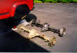
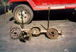
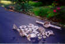
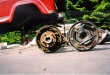
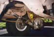

# Swapping an Early Bronco Ford 9" into a YJ

<H4>by [Chris Waterman](mailto:chrisw@off-road.com)</H4>
The early Bronco Ford 9" rear is an excellent upgrade for a
Wrangler YJ.  The early Bronco Ford 9" has a larger ring and
pinion, larger c-clipless axle shafts, removable third member,
inexpensive locker options, and is available in a wide range ring
and pinion ratios.  The Ford 9" uses a 9" ring gear where
as the Dana 35c uses a 7 9/16" ring gear.  The Ford 9"
does not use a c-clip axle like the Wrangler Dana 35c used after 1989.
The early Bronco Ford 9" uses a 28 spline shaft and after market
shafts are available with 31 splines.
The Ford 9" also features a removable third member, so ring
and pinion can be set on a bench without removing the entire axle
housing.  A wide range of ring and pinion ratios are available for
the Ford 9".
The only real disadvantage of the Ford 9" is the slightly lower
pinion.  The Ford 9" pinion comes out lower relative to the
housing compared to Dana axles.  This hurts clearance a bit and
causes a slightly larger drive shaft angle.
### Preparation

The first step of prepartion was to take apart the axles and neatly
file the parts into bags.  I planned on keeping the large
11"x2" drum brakes in the rear, so I made a sketch of
how the springs in the rear drums went together.
*
Pearl of wisdom: Never throw out anything during a project like
this until at least a few months after it's all done.
*.
The next step was grinding off the spring perches and brackets.
This was done with a grinder and the rear was not nearly as difficult
as the front.  After the axle was disassembled and the brackets
and perches were ground off, I took all the metal parts
I was going to re-use down to a local metal cleaning place and had them
stripped. Everything with a bearing race or machined surface in it
got chemically stripped, and the rest, like the knuckles and rear end
housing, got sandblasted.

I wouldn't recommend the sand blasting, it took a long time
to get all that bloody grit out of the axle tubes.  It collected in
there on the thin film of old gear oil that was still inside. Anyway,
aside from that the results were incredible! Those parts looked
absolutely brand new - it was almost scary. The chemical stripping
process removed all the grease and rust from the carriers, spindles,
etc. without removing any uncorroded metal at all, which is important
for those kinds of parts.
### Gears and Bearings
Grant Klavatalks, a local truck guru and mechanic, set up the gears
in my 9" third member and installed the LockRight locker. A that
point I wasn't interested in fooling around with gear setup, and
no one else I knew could show me how it was done, so I had a
professional do it. He found that the ring gear was badly worn,
so in went a new R&P, and out came another $300 Cdn from my
wallet. Ouch.  Along with the new ring and pinion went new carrier,
pinion, and wheel bearings.
Grant was kind enough to swap the carrier in my 9" with a
four pinion model that I'll need as and when I upgrade to 31-spline
axles shafts.  The holes in the stock carrier are too small to
accept the larger diameter 31-spline axle shafts.
One other thing I learned around this point about the EB 9"
is that the four studs at each end that hold the backing plate and axle
shafts on are 1/2" diameter on most axles, but that some have 3/8"
studs. This matters when buying axle shafts, so be sure you know
which you have.  Mine were the 1/2" ones, FWIW.
### Spring Perches
Rather than fabbing up spring perches, I bought two pairs of
adjustable clamp-type perches from Lou Feger's Racing
(p/n 20232-1) in the US. This let me get my pinion angle and
fine-tuned after the axle went into the Jeep.  Since I was
doing a spring over, I just pointed the pinion at the transfer
case yoke (under load) and used a CV drive shaft.
### Brackets
On the rear axle, I fabricated some shock mount brackets from
a piece of square tubing.  The track bar was simply left out.
Running without the rear track bar change the on-road handling
characteristics,
but the Jeep is being built for off-road performance, not
street racing.
### Rear drum brakes
The rears went together real easy. I used all new parts,
including spring kits, adjuster kits, wheel cylinders, and shoes.
I bought two lengths of hard brake line and bent them to fit between
the cylinders and the tee.  Again, keeping the old parts proved to
be a good idea, as I needed the old shoes as cores to get the new
ones. The sketch of the mechanisms inside the drums was useful here,
as were pictures from the service manuals that I photocopied at
the local library.

I may go to rear discs later, but I like the idea of all the static
friction that drums can provide when you're trying to get your engine
restarted on a 45-degree slope. These drums are 11" in diameter, thanks
to the fact that I lucked out and ended up with the "big-bearing" style
3300-lb rated 9" rear.  They are much larger than the 10" drums used
in my Dana 35c and later YJs use a even smaller drum that is only 9"
in diameter.
### Conclusion
The installation was finished by simply hooking up the vent hose
and brake line.  On a regular swap, the same drive shaft and shocks
could be used, but I was also doing a spring over axle conversion.
The details of the spring over conversion of covered in that
article.  Different u-bolt plates, u-bolts, and brake hose
are required for the swap regardless of suspension changes.
The changes I made are covered in the spring over article as well.

</blockquote>