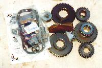
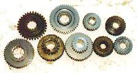
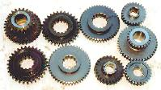
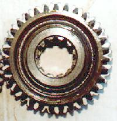
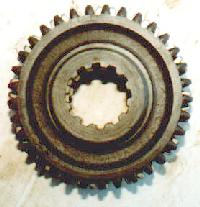
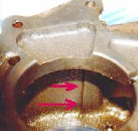
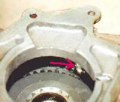
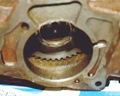

# Product Review: Tera 3.15:1 gear set for Dana 18 and Dana 20 Transfer cases

#### by John Nutter

Low gears are very important for nearly every type of 4 wheeling
and they are especially important for rock crawling. Changing the 
transfer case gears in a 4x4 
equipped with a Dana transfer case is probably the easiest and 
most cost effective way to
achieve a substantial gain in crawl ratio without ruining highway drivability,
thanks to Tera Manufacturing. 

Tera has a 3.15:1 low range gear set available for all Jeep, Early Bronco and 
Scout Dana 18 or Dana 20 transfer cases. The gear set replaces all five gears in Dana 20 applications 
and all four in Dana 18 applications. 
The kit also includes a complete gasket kit, small parts 
kit and new 1-1/4" center shaft. 

## Gear Ratio Comparisons

|  |  |
| --- | --- |
| Tera gears next to factory 2.03:1 low range Dana 20 gears. 
The shiny new gears are from Tera. Note how much thicker the teeth 
are on the Tera sliding gears compared to the originals. | Tera gears next to 2.46:1 low range Dana 18 gears. The sliding gears 
are nearly the same size, but the Tera gears have much thicker teeth and 
a higher tooth count for greater strength. |

|  |  |
| --- | --- |
| 2.03:1 low range sliding gear laid over a Tera sliding gear. 
The Tera gear is significantly larger. | 2.46:1 low range sliding gear laid over a Tera sliding gear. 
The Tera gear is slightly smaller than the 2.46's gear,
requiring less grinding on the case itself. |

| Trans. (1st gear) | Low Range Gearing | axle gears | Crawl Ratio |
| --- | --- | --- | --- |
| T18 (6.32) | 2.03 | 5.38 | 69:1 |
| T18 (6.32) | 3.15 | 3.54 | 70:1 |
| T18 (6.32) | 3.15 | 5.38 | 107:1 |
| 3 Speed (~3:1) | 2.03 | 5.38 | 33:1 |
| 3 Speed (~3:1) | 3.15 | 3.54 | 33:1 |
| 3 Speed (~3:1) | 2.46 | 5.38 | 40:1 |
| 3 Speed (~3:1) | 3.15 | 5.38 | 51:1 |

[Click here for more numbers](tratbl.html)

Changing the transfer case gears from 2.03 to 3.15 has the 
same effect in low range as changing from 3.54 to 5.38 gears while leaving 
high range unchanged for good freeway driving. Changing from a 2.46: 
low range to 3.15 is nearly the same as going from 4.56 to 5.38 gears.
Three digit crawl ratios 
are possible with the use of a compound 
low type transmission such as a T-18, the Tera 3.15 gear set and 
5.38 axle gears. A very respectable 51:1 crawl ratio is the result 
of using the Tera 3.15 
gear set in an early CJ with 5.38 gears and a three speed transmission.

## Installation

The gear set arrives in a well designed shipping box with foam inserts 
to protect 
the gears from damage during shipping. A gasket and seal kit, small parts kit, 
new center shaft and needle bearings, the gears themselves and very 
detailed instructions are contained in the box. The instructions cover 
the disassembly and re-assembly of the transfer case and are very thorough. 
No special tools are need to disassemble the transfer case, but a short 
length of 1-1/4" OD pipe, tubing or wooden dowel is necessary to hold 
the needle bearings in place during assembly.

|  |  |
| --- | --- |
| Arrows point to the ridge I had to remove with a grinder. 
Your particular case may require more or less grinding. | Tera gear slid all the way onto the rear output shaft. 
The arrow points to area where the ridge was ground away. |

| No grinding was required on the top of the case, 
unlike my 2.46:1 conversion. |
| --- |

Assembly is similar to rebuilding the stock transfer case except that 
minor grinding may be required for gear clearance. I found that the 
Tera 3.15 gears required less grinding on the case than the 2.46 gear 
swap using Early Bronco and Dana 18 gears. 
The pictures show where the grinding was required on my particular Dana 20
transfer case. Some cases will need more grinding than mine did, 
some will need less. 
The instructions from Tera have a clear diagram showing where to grind 
for those that are not sure. Remember to do the 
grinding away from the area where you are working on the transfer case and 
to clean the case thoroughly before test fitting the gears.

## Dana 18 Considerations

Early Dana 18s from 1966 or earlier with the small index hole will 
require a large hole Dana 18 or Dana 20 casing becuase there isn't 
enough room for the intermediate gear in a small hole case. Dana 20 
transfer cases are inexpensive to buy used, and all the Dana 18 parts 
will transfer in. This doesn't add much complication, time, or expense to the gear swap.
Dana 18 gear sets will require no grinding, even when used in a Dana 20 
case, becuase the Dana 18 doesn't use the upper sliding gear that 
causes the interference on a Dana 20. 

To install a a Tera low 18 kit in a Dana 20 case start by disassembling 
the Dana 20, set the Dana 20 parts aside, and rebuild the Dana 20 
using all of your Dana 18 parts and the Tera gears. The 2wd/4wd mode 
shift rail will require triming to fit past the larger intermediate 
gear on Dana 18 applications. You will also need a bearing retainer 
for a large hole Dana 18. The bearing retainer for a large hole Dana 18 
can be found on the T86 3spd
trans used from 1966-68 CJs and Jeepsters and also in trucks and wagons from
1961-65. The Jeep part number for this bearing 
retainer is PN JO928477, and it is also available from Advanced 
Adapters if your Jeep dealer or wrecking yard can't locate one. 

At this time Warn/Saturn overdrives are not
compatible with this gear set. PTO units that replace the lower oil pan are not compatible. PTO units that bolt on the rear inspection
plate will work.

## Driving Impressions

There is no difference from stock when in high range, so my freeway 
driving experience was the same as it always was. There is no way I 
could tell if there was an increase or decrease in gear noise in 2WD high 
range due to my soft top and Swampers. I would expect no change in 
noise for Dana 20 equipped vehicles becuase there is no load on the 
gears when in 2WD high range. I am unable to directly comment on gear 
noise in 
Dana 18 equipped vehicles, but the high range gears are hellical cut and 
hellical gears are not normally noisy. 

The difference in crawl ratio was 
very noticable 
in low range, even over my previous 2.46 low range gears. The extra 
control and torque will be greatly appreciated on difficult sections of 
rock trails. I will be using 2nd gear most of the time on Midwestern 
trails and possibly even third on sand hills and between obstacles 
with the Tera gears. 
The only draw back 
I can forsee is that I may need to generate some wheel speed in reverse 
if I get stuck in deep snow
and I may have to go to high range becuase of the low gearing of 
my T-18 reverse gear. I consider the possibilty of having to shift 
into high range for reversing to be a very minor draw back compared 
to gaining this much crawl ratio without reducing my street drivability. 

        **

**

    | Tera Manufacturing
        Dept. ORC
        7055 South 700 West
        Midvale Ut 84047
        801-256-9897
FAX 801-256-9879
Http://www.teraflx.com |
| --- |