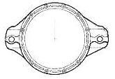
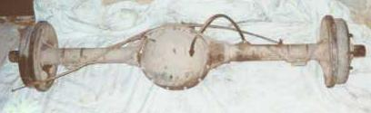
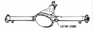

# AMC 20

All AMC 20s have an 8 7/8" R&P and use 29 spline shafts. The AMC 20 R&P is 3/8" bigger than the Dana 44, but it uses smaller shafts, smaller axle tubes, and the CJ version comes with weaker two-piece shafts. The AMC20 uses a 29-spline shaft, where as the later Dana 44 uses a 30-spline shaft. The AMC 20 housing tends to flex a lot, which can cause breakage. This can be remedied by welding the tubes and/or adding gussets. The reason the AMC 20 flexes more than the Dana 44 is the shorter differential housing and smaller axle tubes. Its other flaw is the CJ version uses the two-piece axle made up of a hub and a shaft. The hub end tends to break off under load which has created the market for one piece AMC 20 axle shafts. Unfortunately, the shafts are expensive ($350+ USD) and in some cases a special bearing must be used.

 Identifying the gear ratio of an AMC 20 is a bit tricky. Dana axles normally have a tag on the left of the diff cover with the gear ratio at the time of build. The AMC axles have a code that has to be looked up in a table. The code is stamped on the housing boss to the left of the diff cover right near the axle tube. The good part about the stamp is it tends to stay readable longer than the tag, but you have to know the code. Since there are conflicts between what a code means for a narrow track and what it means for a wide track, don't count solely on the code to identify an axle. Bring a tape measure or know the source of the part.

### Specs

#### Narrow Track AMC 20

| Code | Gear Ratio | Diff Type |
|------|------------|-----------|
| AA   | 2.73       | Open      |
| DD   | 2.73       | Trac-Lok  |
| BB   | 3.31       | Open      |
| CC   | 3.31       | Trac-Lok  |
| A    | 3.54       | Open      |
| N    | 3.54       | Trac-Lok  |
| GG   | 3.73       | Open      |
| Q    | 3.73       | Trac-Lok  |
| L    | 4.10       | Open      |
| M    | 4.10       | Trac-Lok  |

#### Wide Track AMC 20

| Code | Gear Ratio | Diff Type |
|------|------------|-----------|
| D    | 2.73       | Open      |
| DD   | 2.73       | Trac-Lok  |
| B    | 3.31       | Open      |
| BB   | 3.31       | Trac-Lok  |
| A    | 3.54       | Open      |
| AA   | 3.54       | Trac-Lok  |
| H    | 3.73       | Open      |
| HH   | 3.73       | Trac-Lok  |
| C    | 4.10       | Open      |
| CC   | 4.10       | Trac-Lok  |

The Trac-Lok is a limited slip differential. You may have to scrape away a lot of mud, paint, and rust to uncover the code. If you can't find the code on the rear, check the tag on the front axle. Both axles should be geared the same.

The R&P ratio ranges supported by the carriers are 2.73 and 3.31-5.13. The 5.13 gear ratio is not available for the Dana 30, so it is rare to see it. 4.56s are the lowest common ratio between the Dana 30 and AMC 20. 5.13s are available for the Dana 44.

### CJ AMC 20

The CJs used two versions of the AMC 20, the narrow track from '76-'81 and the wide track from '82-'86. Both versions use keyed, two-piece shaft/hub design and 5 on 5.5" wheel bolt pattern. Supplies of AMC 20s were exhausted in 1986 and some Dana 44s were used in the last of the CJ-7s.

From 1976-1978 a larger 11x2" drum brakes was used on the AMC 20. After 1978, a 10x1.75" drum was used.

### SJ AMC 20

The Wagoneer and full-size Cherokee also used a narrow and wide track version of the AMC 20. Both SJ versions used one-piece shafts and 6 on 5.5" wheel bolt pattern. Since the length and bolt pattern is different from the CJ version, the SJ shafts are not compatible without resplining and redrilling. I've never heard of anyone going to the trouble.

| Model/Version          | Spring Pads | Wheel to Wheel | Years   |
|------------------------|-------------|----------------|---------|
| AMC 20/CJ Narrow Track | 36"         | 50.5"          | '76-'81 |
| AMC 20/CJ Wide Track   | 36"         | 54.5"          | '82-'86 |
| AMC 20/SJ Narrow Track |             |                |         |
| AMC 20/SJ Wide Track   |             |                |         |