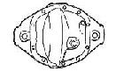

# Jeep Axle: Dana 25

 

It uses a 7 3/4" ring and pinion that is only available in 4.27:1, 4.88:1, 5.38:1, and 6.17 ratios. The Dana 25 came with three different styles of axle shaft joints, the Cardan-Cross style being the best.

Military vehicles with the Dana 25 include the MB, M38, M38A1, and M170. CJs with the Dana 25 include the CJ-2A, CJ-3A, CJ-3B, CJ-5, CJ-5A, CJ-6, and CJ-6A. The Willys Wagon and Willys Pickup used the Dana 25, but the two-wheel drive Wagons and Pickups did not use it.

The CJs used a small drum brake around 9" in diameter. The Willys Wagons and Willys Pickup used larger brakes. The picture on top is from a 1950 CJ-3A with the small brakes. The picture below is from a 50s Willys Wagon with the large 11"x2" brakes. The Willys Wagon and Willys Pickup version is also much wider than the CJ version.

 

 

### Specs

| Model/Version         | Spring Pads | Wheel to Wheel | Years   |
|-----------------------|-------------|----------------|---------|
| Dana 25/Military      | 28"         | 51"            | '41-'65 |
| Dana 25/CJ            | 28"         | 51"            | '46-'65 |
| Dana 25/Willys Wagon  | 28"         | NA             | '46-'65 |
| Dana 25/Willys Pickup | 28"         | NA             | '47-'65 |
| Dana 25/FC Trucks     | NA          | NA             | '57-'65 |
| Dana 25/Wagoneer      | NA          | NA             | '62-'65 |