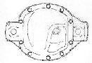
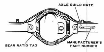
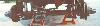
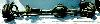
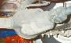
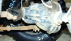
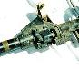

# Jeep Axle: Dana 30

   

This Dana 30 features an open knuckle design with 7 1/5" ring gear. Although the same model axle has been used for almost 25 years, they are not compatible. There are numerous various in brakes, hubs, differential orientation, wheel bolt pattern, and width.

 The R&P ratio ranges supported by the carriers are 2.72-3.54 and 3.73-5.38 for the standard rotation and 2.73-3.54 and 3.73-4.56 for reverse rotation. 

### CJ Dana 30s

 

Early Dana 30s used an 11"x2" drum brake. Disk brakes were optional in 1976 and standard starting in 1977. Between '76-'78 the disk brakes used a large 10-1/2"x1-1/8" rotor. The "big brake" setup uses a 6-bolt caliper mounting bracket that goes between the knuckle and the spindle. The caliper is keyed to the mounting bracket and the rotor should appear wide when looking on edge. Rubber brake hoses with brass banjo fitting. These rotors, calipers, and pads are compatible with the Scout II. 

From 1979-1986 they used a 10-1/2"x7/8" rotor with a two bolt to knuckle caliper mounting bracket. From '79-'81 the caliper is keyed to the mounting bracket and uses rubber brake hoses with brass banjo fitting. From '82-'86 the caliper is pin-bolted to the caliper bracket and the hoses are rubber crimped to steel line. 

All Dana 30s from 1972 to 1980 use a six-bolt locking hub. From '72-'78 the factory had Warn Premium hubs as an option. From '79-'80 the factory used Warn non-premium hubs stock. From 1981 to 1986 they used a weak Warn five bolt locking hub stock. Jeeps built in the 70s with the Quadra-Trac transfer case will not have hubs at all unless they have been converted to part-time operation. They have driven plates instead. Hubs should not be used with this transfer case unless it has been converted to a part-time operation.

Another big difference between the CJ and Dana 30s used in later models is the CJ has the diff case offset on the passenger side and the later models have the diff case offset on the driver's side. 

Most CJ Dana 30s will have lock-outs on the hubs to engage or disengage the wheel from the axle. With both hubs unlocked, the axles, u-joints, differential, and front drive shaft do not spin. This is done to increase gas mileage, and if a locker is installed in the front diff, it will improve handling on the pavement. Later model Dana 30s either an axle disconnect system or no disconnect system. 

The CJ Dana 30 uses the 5 on 5.5" wheel bolt pattern other models use the 5 on 4.5" wheel bolt pattern. 

Outer parts (knuckles out) can be switched amount to different versions of the CJ Dana 30. This means CJs with drum brakes can upgrade to disk and CJs with cheesy 5-bolt locking hubs can upgrade to 6-bolt locking hubs. Later models use different knuckles and ball joints that are not compatible with the CJ Dana 30\. 

Common gear ratios from '72-'75 were 3.73, from '76-'79 were 3.54, and from '80-'86 were 2.73

### Wrangler Dana 30

 

The YJ and the TJ don't use locking hubs. The YJ uses a troublesome vacuum-actuated axle disconnect system. The TJ uses high-quality bearings that have very low rolling resistance, so it doesn't use hubs or an axle disconnect system. Wranglers use a smaller rotor than the CJ. The TJ also uses a different pinion from the YJ. The TJ pinion uses a crush sleeve instead of shims. This difference made gear R&P choice for the TJ a bit limited at first.

 CJ Normal cut Dana 30  YJ Reverse cut Dana 30 

The strength of the YJ Dana 30 is its use of reverse cut ring and pinion. The ring and pinion are stronger when they are reverse cut in front axles. The reverse cut axle also provides better ground clearance and driveline angles.

Unfortunately, the TJ does not use the reverse cut Dana 30. It uses a normal cut Dana 30 similar, but not compatible to, the CJ Dana 30.

 The YJ Dana 30 uses an axle disconnect system that is prone to failure. Often the vacuum hoses activate the disconnect system will fall off or tear. Sometimes the vacuum motor won't have enough power to engage the sleeve when the gear lube in the disconnect housing gets gummed up. Another problem is that since only one axle is ever disconnected, an automatic locker or limited slip differential can cause problems with the axle and with handling. The driver's side axle is always spinning the differential.

. The TJ has done away with the system completely, which is good in that it is not likely to fail, but since there is no way to stop the differential from spinning, an automatic locker or limited slip can degrade handling on the road.

The YJ and the TJ Dana 30 use the 5 on 4.5" wheel bolt pattern. The YJ Dana 30 is set up for leaf springs and the TJ Dana 30 is set up for coil springs.

### Comanche, Cherokee, and Grand Cherokee Dana 30

The Comanche (MJ) and Cherokee (XJ) use a reverse cut Dana 30 and the Grand Cherokee (ZJ) uses a normal cut Dana 30. Like the YJ and the TJ, these axles use a 5 on 4.5" wheel bolt pattern. All of these trucks use coil springs up front.

### FSJ

The Dana 30 front axle was used for a short time from 1971 to 1973 in Cherokees (SJ), Wagoneers (SJ), and J-Series pickups.

### Specifications

| Model/Version           | Spring Pads | Wheel to Wheel | Years   |
|-------------------------|-------------|----------------|---------|
| Dana 30/CJ Narrow Track | 28"         | 53"            | '72-'81 |
| Dana 30/CJ Wide Track   | 28"         | 56"            | '82-'86 |
| Dana 30/XJ              | NA          | 60 3/4"        | '84-    |
| Dana 30/MJ              | NA          | NA             | '86-'92 |
| Dana 30/YJ              | 31"         | 60"            | '87-'95 |
| Dana 30/ZJ              | NA          | NA             | '93-    |
| Dana 30/TJ              | NA          | NA             | '97-    |