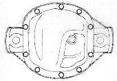

# Dana 30 Rear

A Dana 30 rear end was used briefly in the second generation Jeepster/Commando. It was replaced with a Dana 44 with two-piece shafts.

| Model/Version | Spring Pads | Wheel to Wheel | Years |
|---------------|-------------|----------------|-------|
| Dana 30/C101  | 28"         | 53"            | '6?   |