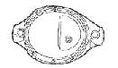
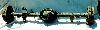

# Dana 35c

The Dana 35 has a 7 9/16" ring and pinion and uses one piece axles (2.625" in diameter). Starting in 1990, they switched to an inferior C-clip Dana 35c. The "c" in Dana 35c does not stand for C-clip, it stands for custom. They are custom because they are shipped incomplete from the Dana factory to Chrysler, and Chrysler completes the build. The two versions have different shafts, bearings, and carriers. There is a C-clip eliminator kit available for the Dana 35c. The Dana 35c is probably on the small side for hard four wheeling with larger tires and lockers. If these are your intentions, you might be better off swapping in a Dana 44 or better.

Early YJs built from '87 until '89 used a 10" rear drum instead of the 9" drum used in the later YJ and TJ Dana 35c. The axle in the picture above has the 10" drums.

The R&P ratio ranges supported by the carriers are 2.73-3.31 and 3.55-4.56. 

### Specs

The Dana 35c is the axle used in all YJs (Wrangler) from '87-'95, and it is the standard axle in the TJ (Wrangler), ZJ (Grand Cherokee), MJ (Comanche), and XJ (Cherokee). The Dana 44 is an optional axle on the TJ, ZJ, MJ, and XJ. Some XJs were built with the corporate Chrysler 8.25 axle as standard. The TJ and ZJ versions are coil sprung, the XJ version is leaf sprung (spring over), and the YJ and MJ versions are leaf sprung (spring under).

| Model/Version | Spring Pads | Wheel to Wheel | Years   |
|---------------|-------------|----------------|---------|
| Dana 35c/XJ   | NA          | 60 3/4"        | '84-    |
| Dana 35c/MJ   | NA          | NA             | '85-'92 |
| Dana 35c/YJ   | 40"         | 60"            | '87-'95 |
| Dana 35c/ZJ   | NA          | NA             | '93-    |
| Dana 35c/TJ   | NA          | NA             | '97-    |