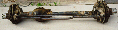

# Front Dana 30

   
Uncut front Scout II Dana 30 

The Dana 30 from a CJ makes good swap material for '45-'71 CJs because parts are much easier to find, it has open knuckles, and disk brakes where a factory option.

If you are looking for parts for a Dana 30, Scouts used Dana 30s for a while in the early 70s. Hubs and brake hubs from these vehicles can be used on Jeep Dana 30s. This version used the larger rotor used in early Jeep Dana 30s with the "big brakes." It would be a lot of work for the gain to swap a Scout II Dana 30 into a Jeep.

### Uncut Front Dana 30 Sizes

The accuracy of the dimensions is not guaranteed, get out your tape measure. Refer to the [factory options Dana 30](/axle/factory/d30.md) page for sizes of Dana 30 front axles used in Jeep vehicles.

| Model/Version    | Spring Pads | Wheel to Wheel |
|------------------|-------------|----------------|
| Dana 30/Scout II | —           | 60"            |

### Front Dana 30 Swap Stories

|  [Dana 30 Disk Brake Conversion](https://www.4x4wire.com/jeep/projects/pieces/front/): Terry Howe does a disk brake conversion of a drum brake Dana 30 for Project Pieces and Parts. Everything you need to know to swap disks on your '72-'76 CJ with drum brakes. This article also explains why the Dana 30 is a good low-buck axle upgrade for '45-'71 CJs.   
---|---