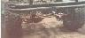

# Front Dana 44

Scout and Wagoneer front Dana 44s are good candidates for swapping into a CJ, but shortening is required to maintain stock widths. These axles can also be put in uncut by moving the spring perches outside the frame. An article below discusses doing this with Scout axles on a CJ.

If you are going to get axles cut, wide track CJs only need the long side shortened. A narrow track CJ would need both sides shortened to keep the stock width. Pictured above is a Scout Dana 44 narrowed to narrow track specifications on Rick's '77 CJ-7.

The Scout and Wagoneer Dana 44 front axles are close enough to the proper width for Wrangler YJs. One spring perch needs to be moved slightly on the Wagoneer front end. The difficulty with the YJ is finding knuckles that allow full steering.

### Front Dana 44 Sizes

The accuracy of the dimensions is not guaranteed, get out your tape measure.

| Model/Version                 | Spring Pads | Wheel to Wheel |
|-------------------------------|-------------|----------------|
| Dana 44/Scout II              |             | 58"            |
| Dana 44/Narrow Track Wagoneer |             | 58.4"          |
| Dana 44/Wide Track Wagoneer   |             | NA             |
| Dana 44/Early Bronco          |             | NA             |