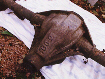
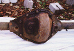
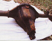

# Jeep Axle Swaps: Rear Dana 60

Some Jeep "heavy" 1/2 ton pickups used a semi-floating Dana 60 with a 5 on 5 1/2" wheel bolt pattern. The standard 1/2 ton pickups used a Dana 44 and the 3/4 ton pickups used a full floating Dana 60 with different wheel bolt pattern. This axle makes a great low buck Dana 60 option since the wheel bolt pattern matches the normal CJ wheel bolt pattern. These axles are wide for a CJ, but the tubes can be cut and rewelded and the shafts cut and resplined. The axle in the photograph is from a '73 J-4000 pickup. I've seen this axle on J-4000s and since it was used from '73-'79, it must be available on some J-10s as well. This axle had 12" brakes, which might need to be swapped out to fit in a 15" wheel. Note the 60-2 cast on the bottom of the differential cover. This type of axle is probably available in some Chevy and Ford pickups.

This axle was available with 4.09:1 R&P standard and optionally with 4.88:1 R&P when used behind a Dana 20 transfer case. It was also used with the Borg-Warner 13-39 Quadra-Trac transfer case with 4.09:1 R&P. The version used with the Quadra-Trac probably has an offset differential, so perhaps you could get away with only shortening one side of this axle.