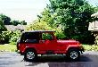
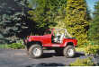
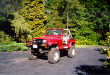
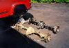
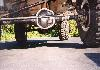
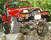
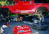

# Swapping Early Bronco Axles into a YJ

**by Chris Waterman**

Who in their right mind would take a perfectly functional 9-year-old Jeep YJ, rip out the entire undercarriage, and replace it with parts from a 25-year old Ford? Chances are if you're reading this then you understand already, but for those of you who don't...

  * Stock YJ axles are a relatively weak link in an otherwise excellent vehicle. If you want to run tires over 31", especially with lockers, then the odds of breaking an axle shaft or u-joint, or even bending a housing, go way up under even moderate usage.
  * The early Broncos, on the other hand, were big, heavy, and thus very solidly built. The stock axles for a 1973 EB were a standard-cut Dana 44 up front and the much-praised Ford 9" in the back. In a YJ they make for a very stout combination and reduce the odds of breakage even with large tires and lockers.
  * The brakes are bigger all around (I've ended up with 11" discs and 11" drums). The axles are about four inches wider than on the YJ, which is nice for a little extra stability too.
  * It was a cool project. Early on in the game I discovered that I couldn't find anyone who had ever done this swap before, so from then on it became a personal challenge. Something about the risk involved appealed to the fool within me. That and I had no idea what I was really getting into. My most ambitious project before this was an on-board air system (not even in the same ballpark) and while I'm mechanically inclined this was way beyond anything I'd ever done before.

### How did it start?

Before the swap, My Jeep was a relatively stock 1989 YJ. It had 2.5" OME lift springs in it and 31" AT tires, and that was as far as I thought I wanted to go with lift. Then Larry Soo (aka lars) got involved. I remember one conversation:

Larry : "You should do a spring-over. Hmm... spring-over with OME springs."
Me: "Uh, yeah, right. Heh heh."

But the seed was planted. I'd wanted to get a rear locker for a while, but didn't like the idea of throwing $$ at the stock D30 and D35 axles after hearing them bashed so often on the Jeep-L and Jeeptech lists.

Some time later, Larry told me about a friend of a friend who was selling a pair of axles from an old Bronco. I went over to see them. They looked terrible! Covered in rust and some kind of green mildew, but the potential was there! The rear end had the stock 28-spline axles, and the front had a standard-cut diff and drum brakes, but the width looked good and they had 4.10 gears in them. Next thing I know, I've purchased the axles and I'm planning a spring over axle conversion.

[Ford 9"](f9.md): Preparation and installation of the Ford 9" rear from an Early Bronco into a Wrangler YJ. The Ford 9" is massive compared to the stock Dana 35c. [Dana 44](d44.md): The early Bronco Dana 44 had 30 spline shafts, 8.5" ring gear, and real hubs. There are many advantages of a Dana 44 front end in a Wrangler or CJ. [Spring Over](soa.md): Doing a spring over conversion on a Wrangler YJ for maximum articulation. The conversion is a bit more work than a normal lift, but the results are amazing. [Final Notes](conclude.md): Some final notes on the spring over axle swap and early Bronco axle swap. Important things like wheel bolt patterns must be considered.