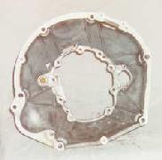
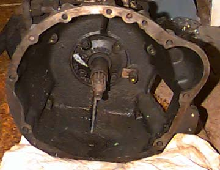

# Bell Housings

Some factory bell housings for comparison.

## 258(4.2L) Bell Housing

The AMC engines have a round bolt pattern with the starter pocket low on the passenger side.

 

The bolt pattern on the T-18 is wider than the later transmissions, as can be seen here.

 

## 242(4.0L) Bell Housing

This should be a bell housing for a 4.0L to an AX-15.
Starter pocket low on the passenger side.
There is a crank position sensor in there.
Instead of a manual clutch fork, this bell housing would have an attachment for a slave cylinder.
Unfortunately, the slave cylinder is mounted inside the bell housing here, which makes maintenance more difficult.

 

## T-14?(4.2L) Bell Housing

I'm pretty sure this is a T-14 bell housing to an AMC engine.

 

## ???(2.5L) to T-90 Bell Housing

The starter pocket is high on the drivers side engine I would guess to a T-90. I'm not sure what engine this is for.

