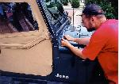
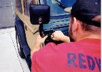
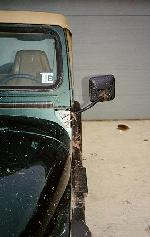

# Installing CJ Mirrors on a Wrangler

By: Terry L. Howe - 3/2000

*Drilling holes for the mirrors - photo by Zach Krueger*

*Using a tap to thread the holes - photo by Zach Krueger*

*Installing the mirrors with stainless steel cap screws - photo by Zach Krueger*

*The Wrangler with CJ mirrors on either side*

*Close up of drivers side mirror*

When the warm weather hits, the first thing most jeepers want to do is take off the top and doors. Most Wrangler owners cannot take the doors off their Jeep and remain street legal. Many areas require an external mirror on the drivers side to be street legal and the mirrors are attached to the doors on the Wrangler. One solution is to install CJ mirrors on your Wrangler.

CJ mirrors can be bought inexpensively from JC Whitney and the like and they are easy to install on a Wrangler. One solution is to purchase after market windshield hinges that are threaded for the mirrors. The hinges are typically difficult to remove and it adds to the cost. The easy and inexpensive way to go is simply drill and tap holes in the existing hinges.

## Required Tools

- High speed drill
- 13/64ths drill bit
- 1/4-20 tap
- Center punch
- Hammer

## Installation

There isn't an exact science to placing the mirror on the hinge. It should be at a 30 degree angle on the hinge. If you have a CJ handy, make a template out of a piece of paper. After you have the mirror in place, use a center punch to mark the holes out. Drill out the holes with the 13/64ths drill bit and tap the holes with the 1/4-20 tap. I used some 1/2"x1/4-20 stainless steel cap screws to attach the mirror to the hinge.

## Passenger Side Mirror

One tricky thing about CJ mirrors that often confuses people is the passenger side mirror. The passenger side mirror on a CJ is designed to be viewed through the windshield, not through the passenger door window. It gets placed at the same angle as the drivers side, but the arm should be a bit forward so it can be seen from the drivers seat.

## Recommendations

When you order mirrors, I'd recommend getting the convex mirror for the passenger side and a regular one for the drivers side. The flat mirror on the drivers side gives you a relatively undistorted view. The convex mirror on the passenger side greatly increases your visibility. The passenger mirror is a lot harder to adjust when you are driving, so the convex mirror is more likely to be useful even if the mirror gets knocked out of place by a tree or rock.

On the hard doors, I simply took off the mirrors and threw them in a box. I always meant to get some stainless screws to cover the holes in the door, but I never got around to it. I don't think much water gets in through the small holes and the hard doors are in the garage for 2/3rds of the year anyway. It is also pretty dry where I live, so it isn't as much of an issue as it might be in a more humid climate.

If you aren't sure about your local laws, get the passenger side mirror. Not all areas require a passenger side mirror, but some do. Better safe than sorry and the passenger side mirror is handy at times.

Another neat trick that can be combined with this modification is the [Mirror Quick Release](mirrorqr.md). I used some mountain bike seat post quick releases on my CJ mirrors so that they can be moved and adjusted easily.
