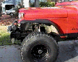
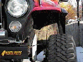

# The Jeep Flat Fender Look

Giving your Wrangler, CJ-7, or CJ-5 the flat fender look not only looks cool, it increases tire clearance. Many of round fender Jeeps you'll find on the hard trails have adopted this look for increased tire clearance, tighter turning radius, and longer fender life.

If you plan to drive your Jeep on the street, check your local laws to make sure that bobbing the bumper and removing the side marker lights will not make your Jeep illegal. The side marker lights can be moved up to the side of the hood if they are necessary to stay street legal.

### Cutting The Fenders

 If you are going to remove your side marker lights and keep your fender flares, you'll need to leave enough material on the fender to attach the fender flare. The top of the fender flare should be lined up with the top of the fender, which for most fender flares, will mean you'll be removing about 3/4" of material all around the edge.

 Before you start cutting anything, remove the side marker lights and secure the wires out of the way. Next, put down a layer or three of masking tape over the area you plan to cut to protect the paint and to make it easier to draw a line.

The front of the fender will require some imagination and what you cut will depend on personal taste. To get a true flat fender look, you'll need to remove most of the round front part of the fender. You may want to scribe a guideline along the front grill since it will be challenging to see what you are cutting when you are cutting along the grill. Mark out both sides so you get an even look.

 Once you have the lines drawn, use a saber saw with a 24 tooth per inch blade or similar tool to remove the material. This should leave a very clean cut that only needs some filing to remove burrs and some touch up paint.

After everything is cut and painted, you'll want to remount your fender flares. Before you mount them, you'll need to trim them down using a utility knife with a sharp, new blade. Trim them to the new lines of your fenders and try not to cut your finger.

### Chopping the Bumper

There's a trail in Colorado called Mine Sweeper that is a test of bumper length. The first obstacle is called "Winch and Go" because almost no one makes it. Those that make it have a short bumper because it is a large stone step, and once you crest it, you have to make a sharp right. If your bumper is too long, you won't be able to make a sharp enough right, and you'll be stuck on the crest or bounce back down. If you've been to Moab, it is like Bump Dump on Hell's Revenge with a turn at the top.

Again, you might want to check local laws before chopping your bumper. You can cut your bumper really short like Mark did, or you can leave some. The easy way to tell the maximum amount of bumper to leave is by turning the wheel to the stop and taking a straight edge along the outside edge of the tire. Chop the bumper along this plane. A circular hand saw with a metal cutting blade works great for this. Wearing safety goggles when you cut will prevent the red-hot metal particles from entering your eyes.