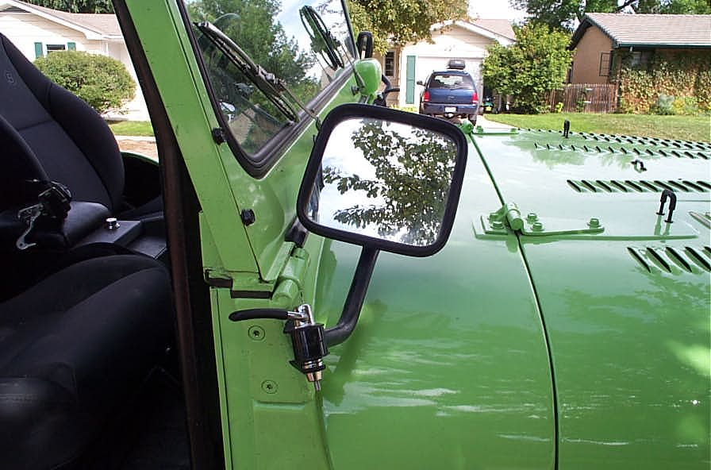
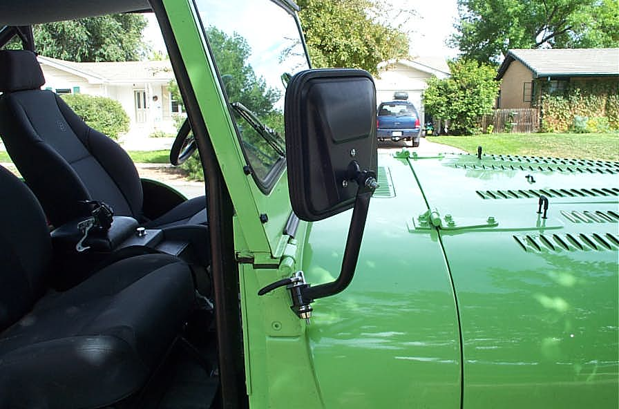

# QuickLever Mirror Release
By: Terry L. Howe - 10/2003

The mirror folded out of the way.

The mirror adjusted for use.

Drivers side.

Adjusting the mirrors on your Jeep and moving them out of the way is always been a compromise. If you leave your mirrors loose enough to move them out of the way, they get bumped out of adjustment all the time. If you tighten them up so they don't get bumped, you cannot move them out of the way. The QuickLever mirror release allows you to keep the mirrors tight and still move them out of the way with no tools.

[QuickLever mirror releases work on 1955-1986 CJs external mirrors. This style mirror is also a nice upgrade for Wranglers](cjmirroryj.md)if you want to take the doors off.

Installation of the QuickLever mirror release only takes a minute. Remove the bolt that holds on the mirror arm and put in the QuickLever. With the arm of the QuickLever concave out, tighten the nut down snug with your fingers. Flip the lever and it tightens down the mirror. After the QuickLever nut is properly set, you can just flip the lever to adjust the mirror or move it out of the way.

I just had to get a set of QuickLevers for my CJ-6. I'd had a set on my CJ-7 years ago and loved the convenience. The cost of convenience of QuickLever cannot be beat.