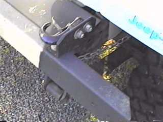
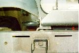
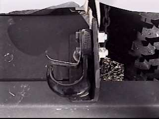

# Tow Hook Bracket

If you don't have tow hooks already, they are one of the first modifications you should make to your Jeep. A great way to become unpopular is to get stuck in a big mud pit without tow hooks. Many 4x4 events require that vehicles have tow hooks to participate in trail rides. If you drive a Jeep Wrangler YJ, you'll find the common $10 hooks won't bolt on and the hooks from the dealership retail for over $60 USD. Some suppliers have started selling a less expensive hook that fits the stock holes on a Wrangler, but these hooks are not available in all areas. The high cost of OEM tow hooks and the desire to have tow hooks as well as a winch inspired Dave Moulton and Kirk Beasley to come up with this inexpensive way to mount common tow hooks on Jeep Wranglers and CJs.

The use of this tow hook bracket allows you to mount standard tow hooks without drilling your frame. It also allows you to easily have tow hooks even with a winch mounted up front. The angle iron can replace the 1/4" spacer that goes between the winch plate and frame brackets. The hooks can be mounted outboard, rather than inboard like Dave's hooks.

 Here's a shot of the hook and the angle iron. The two washers are the spacers from the winch mount kit that the angle iron replaces.  From the front, you can see how the angle iron fits between the two brackets of the winch mount on Kirks's CJ.

To add your own bracket-mounted tow hooks, you will need:

  * Standard tow hooks that you should be able to purchase for around $10 with bolts.
  * About 1 foot of 2 1/2" to 3" angle iron 1/4" thick.
  * Two 1/2" x 1 1/2" grade 5 bolts (angle iron to frame).
  * Two 1/2" x 2" grade 5 bolts (angle iron to hook).
  * Two 1/2" grade 5 nuts.
  * Four 1/2" lock washers
  * Fourteen 1/2" flat washers, 7 on each side
  * A saw for cutting metal, a circular saw with metal cutting blade works well.
  * A drill and a 1/2" drill bit
  * Utility knife.
  * Safety goggles.

Most of the supplies you should be able to get at your local hardware store. You may be able to find the angle iron used at your local iron yard. Used iron sells around here for $0.18 a pound, so this piece should cost next to nothing.

All that you need to do is cut the angle iron to length and drill each piece for the tow hooks on one side and for the factory tow hook mounts on the other. Dave used a 2"x3"x6"x.25" piece of angle iron with the long side up, while Kirk reports using a 2"x2"x5.5"x.25" piece of angle iron. You may need to trim the plastic cover plate away with a utility knife to expose the rear mount hole, the front hole mounts through the top bumper bolt. Use the flat washers to fill in the space under the angle iron on the rear mount hole. Bolt everything down and torque to spec.

When you use your tow hooks, always make sure that everyone is clear. If a tow hook breaks loose, it can become a deadly projectile!

