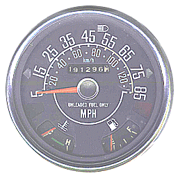
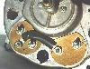
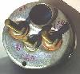

# Jeep CJ Gauge & Sender Diagnostics

**by John Foutz**

This article only covers gauges and sending units used in the AMC Jeep CJs built from '72-'86, but some of this information will be useful for owners of other Jeeps. There are some slight variations with the Jeeps built from '72-'75, but starting in '76 things remain pretty consistent for 10 years.

### About the Gauges

The meter movement in all the gauges have a built-in dampening mechanism which keeps the needle from bouncing around. The dampening mechanism is basically some thick grease on the movement's pivot points.

The reason all the meters are dampened is because the senders do not have a very constant resistance. If you put a good testing meter on the sender while the motor is running you will see the resistance bounce all over the place. The dampening averages out the reading. This also is why it takes a few seconds for the needles to come up to position instead of snapping to a reading.

When ordering replacement Fuel and Temp gauges for your Speedometer cluster, Stewart Warner brand are considered the best. These have "C" and "H" as well as the "E" and the "F" in the stock OEM orientation.

Imported after-market gauges have these ranges reversed, both are 12v, and have a different wiring and post setup. Use their instructions and diagrams during replacement.

### About the Sending Units

The oil pressure sender is similar to the fuel gauge sender. The mechanical parts are different, but after that it is basically a coil of resistance wire wrapped around a card and the wiper moves across the winding to change the resistance. The higher the fuel level or engine oil pressure, the lower the resistance. With less resistance, more current flows and the gauge reads higher.

The oil pressure sender and fuel sender are both electro-mechanical devices but the temperature sender is not. The temperature sender is a temperature dependent resistor (Thermistor). The type in the Jeep is a NTC (Negative Temperature Coefficient) which means that as the temperature goes up, the resistance goes down.

## Gauge Sizes

Gauge| Diameter  
---|---  
Oil Pressure| 2"  
Volt meter| 2"  
Tachometer| 2-7/16"  
Clock| 2-5/8"  
Speedometer cluster| 5-5/8"  
  
## Fuel and Temperature Gauges

From the passenger side which is left to right in the picture above.

  * Fuel Gauge S Terminal - pink wire (from fuel sender)
  * Fuel Gauge A Terminal - 12v side of Jumper/Regulator Strip to temperature gauge
  * Fuel Gauge I Terminal - red wire (ignition-on hot 12v)
  * Temperature Gauge A Terminal - Jumper from fuel gauge A terminal (Jumper Strap regulated to 5v)
  * Temperature Gauge S Terminal - Purple wire (from temperature sender)

Some manuals have the positions of these terminals incorrectly identified. You can see the letters stamped in the insulation material around the posts.

The Jumper/Regulator Strap is composed of two strips of metal that continuously make and break contact, regulating the output to the Temp gauge to 5 volts. A volt meter applied to the A terminal on the Temp gauge should fluctuate (plus and minus) near 5 volts. A reading of 12 volts on the temperature side indicates a bad Jumper/Regulator Strap. 12 volts applied to the temperature gauge's A terminal will cook the gauge.

## Fuel Gauge

The fuel gauge should have the following resistances ...

  * S to Ground 68-72 ohms
  * S to I 19-21 ohms
  * S to A 19-21 ohms
  * I to A Zero
  * I to Ground 49-51 ohms
  * A to Ground 49-51 ohms

The fuel sending unit wires are located on top of the gas tank where they are hard to get to without dropping the tank. The fuel sending unit should have a pink wire with voltage on the isolated center post. The other black wire on the sending unit with a tab style connector is a ground to the frame. Make sure it has good contact.

To be sure the problem is not the gauge, you can momentarily short the pink wire on the output of the sender to ground, and this should show up as FULL on your gauge. DO NOT hold it for very long in this position. If the gauge does not move from EMPTY either the wiring has an open circuit (no voltage, or no connection to ground) or he gauge is bad. If it does move, the sending unit is bad.

The sending unit can be checked with an ohmmeter to measure the resistance between the round sender post (pink wire) and ground. It should be:

Resistance| Reading  
---|---  
73 ohms| Empty  
23 ohms| 1/2 tank  
10 ohms| Full  
  
If the resistance falls in this ballpark (depending on how much gas you have in the tank), then the sending unit is fine. If it shows infinitely HIGH resistance, then the sending unit could be bad OR the wire from the tank to the gauge could be open.

The gauge can be tested with the resistances listed above. Run an appropriate resistor to the S terminal of the fuel gauge and to ground and check the readings.

## Temperature Gauge

The temp gauge has the following resistance ...

  * S to A 19-21 ohms

A volt meter can be used to measure the voltage between the A terminal of the Temp gauge and ground. It should be pulsing and averaging about 5 volts. If it reads 12 volts the Jumper Strip/Regulator is bad. If it reads 0 volts, it has been burnt out.

The sending unit can be checked with the following resistances between the post and ground...

Totally Cold| high resistance  
---|---  
Slightly Warm| 73 ohms  
Beginning of Band| 36 ohms  
End of Band| 13 ohms  
Hot| 9 ohms  
  
If an appropriate resistor is connected to the S terminal of the temperature gauge and to ground, the above resistances can be used to check the gauge. Use a resistor close to the specifications above to simulate the sending unit.

## Oil Pressure Gauge

From the passenger side, left to right in the picture..

  * Oil Pressure gauge S terminal (left) - Purple wire from sender
  * Oil Pressure gauge middle terminal - Black wire (Ground)
  * Oil Pressure gauge right terminal - Red wire (Ignition-on hot 12v)

The oil pressure sending unit is on the engine block and looks like a small 2 X 3 inch filter with one terminal. There may be another sender plumbed in the same area that has two connectors. It is an oil pressure switch that is supposed to close below 4 psi to activate a dash warning light in some speedometer clusters.

To be sure the problem is not the gauge, you can momentarily short the wire from the output of the Sender to ground. If there is no resistance, your gauge should read 80 psi. DO NOT hold it for long in this position. If the needle does not move from zero psi then, either the wiring (open circuit) or the gauge is bad. If it does move, the sender unit is bad.

It is very common for the sending units used with the 258 and 232 engines to be inaccurate. Make sure you have a good connection to the sending unit.

It is easiest to test the sending unit by temporarily plumbing in a good mechanical gauge.

Pressure (PSI)| Resistance (ohms)  
---|---  
0| 234-246  
20| 149-157  
40| 100.5-105.5  
60| 65-69  
80| 32.5-34.5  
  
## Volt Meter

From the passenger side, left to right in the picture ...

  * Volt Meter gauge GND terminal (left) - Black wire (Ground)
  * Volt Meter gauge terminal (right) - Red wire (Ignition-on hot 12v)

Testing the voltmeter is easy, you just need a good 12 volt connection to the (+) post and have a good ground to the (-) post. If the gauge shows no activity, then the gauge is bad.