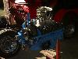

# AMC 304 V8

The AMC 304 uses a cast iron block and heads with over head valves and hydraulic lifters. The AMC 304 was introduced in Jeep vehicles in 1971 in J-series pickups and Wagoneers and in 1972 in the CJ vehicles. Early 304s performed well, so well that frame changes were made to the CJs in '73 to prevent cracks.

Meeting legal requirements for smog controls on the 304 severely hurt performance of the engine. The last two years of the 304 in the CJ were in '80-'81. The horse power and torque specifications of the last version of the 304 narrowly beat the 258 use at this time. The 258 used between '80 and '81 was putting out 110 HP @ 3500 and 195 ft/lbs @ 2000.

The 304 used from '80-'81 in CJs, J-series pickups, and Wagoneers suffers in performance.

| Attribute           | Specification |
|---------------------|---------------|
| Bore x Stroke       | 3.75" x 3.44" |
| Displacement        | 304(4.98L)    |
| Compression Ratio   | 8.4:1         |
| Horsepower (net)    | 125@3200      |
| Torque (net)        | 220@2400      |
| Main Bearings       | 5             |
| Valve Configuration | OHV           |
| Fuel                | 2bbl          |

The '79 304 saw a significant drop in horse power from previous years.

| Attribute           | Specification |
|---------------------|---------------|
| Bore x Stroke       | 3.75" x 3.44" |
| Displacement        | 304(4.98L)    |
| Compression Ratio   | 8.4:1         |
| Horsepower (net)    | 130@4200      |
| Torque (net)        | 245@2500      |
| Main Bearings       | 5             |
| Valve Configuration | OHV           |
| Fuel                | 2bbl          |

The 304 used from '72-'78 has the best performance of all the 304s used in the CJ. The 304 was not offered in J-series pickups and Wagoneers after 1972.

| Attribute           | Specification |
|---------------------|---------------|
| Bore x Stroke       | 3.75" x 3.44" |
| Displacement        | 304(4.98L)    |
| Compression Ratio   | 8.4:1         |
| Horsepower (net)    | 150@4200      |
| Torque (net)        | 245@2500      |
| Main Bearings       | 5             |
| Valve Configuration | OHV           |
| Fuel                | 2bbl          |

The ratings for the 304 used in '71 J-series pickups and Wagoneers are gross ratings.

| Attribute           | Specification |
|---------------------|---------------|
| Bore x Stroke       | 3.75" x 3.44" |
| Displacement        | 304(4.98L)    |
| Compression Ratio   | 8.4:1         |
| Horsepower (gross)  | 210@4400      |
| Torque (gross)      | 300@2600      |
| Main Bearings       | 5             |
| Valve Configuration | OHV           |
| Fuel                | 2bbl          |

AMC 304 AMC 304 AMC 304