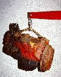

# Swapping a Buick V6 Into Your Jeep

   
**by Terry L. Howe**

Consider the Buick V6, it is short, plentiful, and powerful. What more can you ask for in your short Jeep. The Buick is well suited for a swap into any short CJ-5, CJ-3B, CJ-3A, CJ-2A, or their miliary brethren. It isn't so powerful you'll rip your frame apart and break your axles and it is spunkier than the F-Head and L-Head engines. It is also easy to buy and buy parts for.

### "Dauntless" Buick 225

From 1966 until 1971 Jeep used the Buick 225 V6 as the optional engine in CJs. Kaiser purchased the tooling to build the engine from Buick in 1967 and began production of the engine. The "Dauntless" 225 is an "odd fire" engine meaning the cylinders fire odd order. The odd-fire design cause a the engine to idle a bit rough. This version of the engine and parts from these Jeeps can be used to swap a Buick V6 into your Jeep.

One big advantage of the Dauntless 225 V6 is the heavy flywheels used on these engines. The flywheels come in 75lbs and 100lbs versions to create low end torque. The normal car flywheels are closer to 45lbs.

### Buick 231

When AMC purchased Jeep, they started putting AMC engines in Jeeps. The Buick V6 was not used after 1971 and with the gas crisis, Buick became interested in the V6 engine again. They purchased the tooling back from Jeep in 1974 and reworked the engine so it use components from the Buick 350 engine. The larger bore increased the displacement to 231 cubic inches.

In mid 1977, Buick introduced the first "even fire" version of the Buick V6. This engine has a smoother idle, but more vibration than the older engine. The odd fire engine uses a distributor cap with equal spaces between the plugs on the distributor cap and the even fire engine has unequal spaces between the plugs on the distributor cap. It is not very intuitive, but that's the way it is.

The 231s are internally balanced and the 225s are externally balanced. Technically, you need to rebalance a 231 if you replace the flywheel or install a flywheel in place of a flex plate. Some people report that they have had no problem swapping different flywheels on these later engines with out rebalancing.

Later Buick 231s use multiport fuel injection. The Buick V6s never used TBI fuel injection from the factory.

### Swap Stories

[ Project Pieces & Parts Engine Installation ](https://www.4x4wire.com/jeep/projects/pieces/engine/): Project Pieces & Parts finally gets the fired up with a Buick 231 V6 sitting on engine mounts from Advanced Adapters. 
  
### Bibliography

Some of the information in this article was obtained from Ken Mosher's [Buick V6 History](https://ni.umd.edu/gnttype/www/v6hist.md) article.