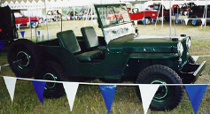

# CJ-2A

The CJ-2A was the first civilian Jeep. It was produced from July 17th 1945 through 1949. It looks similar to an M38, CJ-3A, or MB, but it has flush-mounted headlights and the windshield is made with round tubing. The windshield is split were as the CJ-3A uses a one-piece windshield (except for some export versions), is made with square tubing, and is taller above the glass. CJ-2A tubs are compatible with the M38, CJ-3A, and MB tubs, but there are cosmetic differences. All of them used the "Go Devil" L head 134 I4 engine.

### Variations

Early versions of the CJ-2A (until 1946 serial number 38220) were produced with a column shift T-90. The later versions of the CJ-2A were produced with "three on the floor" rather than "three on the tree." Some early CJ-2As also had the Spicer 23-2 rear end and shovel and axe grooves on the driver's side like one would find on the MB. Later CJ-2As had a Dana 41 rear end and no grooves on the driver's side.

## Drive Train

The CJ-2A used the ["Go Devil" L-Head 134 I4](../engine/factory/godevil134.md) engine. Early CJ-2As were equipped with a column shift [T-90](../transmission/factory/t90.md) 3 speed while later models used a floor shift version. The 26-tooth small hole [Dana/Spicer 18](../xfer/factory/d18.md) transfer case was used. The front axle was a [Dana/Spicer 25](../axle/factory/11-d25.md) with drum brakes. Early CJ-2As used the full-floating [Dana/Spicer 23-2](../axle/factory/14-s23.md) while later models used the semi-floating [Dana/Spicer 41](../axle/factory/12-d41.md).

## Production Information

| YEAR | BODY  | MODEL | START  | END    | UNITS |
|------|-------|-------|--------|--------|-------|
| 1945 | CJ-2A |       | 10001  | 11824  | 1824  |
| 1946 | CJ-2A |       | 11825  | 83379  | 71554 |
| 1947 | CJ-2A |       | 83380  | 148458 | 65078 |
| 1948 | CJ-2A |       | 148459 | 222581 | 74122 |
| 1949 | CJ-2A |       | 222582 | 224764 | 2182  |

### Serial Number Locations

Serial numbers are located on the outside of the left front frame horn, behind the bumper. An exception to this is the first 100 or so 1945s where the frame tag is on the inside frame horn reinforcement like the MBs.

The engine number was located at the front of the engine block on the water pump boss.