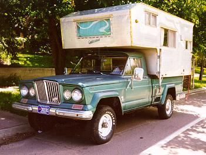

# J-Series Pickups

The J-Series Pickups was produced from 1963 until 1987. J-Series pickups have used various model designation schemes over the years. These models are what we would consider a full-size pickup today. Early models were known as Gladiator pickups.

From 1963 until 1964 a 3 digit number was used to designate the wheelbase and GVW of the vehicle. Models were available with a 120" and a 126" wheelbase and most models were available in Thriftside (narrow box), Townside (wide box) and cab & chassis models.

| Model | Type                                      |
|-------|-------------------------------------------|
| J-100 | panel delivery                            |
| J-200 | 1/2T 5000 GVW (120" wheelbase)            |
| J-210 | 1/2T 6000 GVW (120")                      |
| J-220 | 3/4T (120")                               |
| J-230 | 1T cab & chassis or stake bed only (120") |
| J-300 | 1/2T (126")                               |
| J-310 | 3/4T (126")                               |
| J-320 | 1T (126")                                 |
| J-330 | 1T cab & chassis or stake bed only (126") |

In 1965 they switched over to a four digit model number except for the J-100. In '67 the two wheel drive models were dropped. In 1970, the Gladiators got the same style grill as the Wagoneer, its first styling change since its introduction. The 3000 series was dropped in 1971. The "Gladiator" name was dropped in 1972 and the J trucks were simply called Jeep trucks.

| Model  | Type                 |
|--------|----------------------|
| J-2500 | 1/2T 5000 GVW (120") |
| J-2600 | 1/2T 6000 GVW (120") |
| J-2700 | 3/4T 7000 GVW (120") |
| J-2800 | 1T 8600 GVW (120")   |
| J-3500 | 1/2T 5000 GVW (126") |
| J-3600 | 1/2T 6000 GVW (126") |
| J-3700 | 3/4T 7000 GVW (126") |
| J-3800 | 1T 8600 GVW (126")   |

In 1970 three new Gladiators models were added to the line-up.

| Model  | Type                                                      |
|--------|-----------------------------------------------------------|
| J-4500 | 1/2T 5000 GVW Townside only (132")                        |
| J-4700 | 3/4T 7000 GVW Townside only (132")                        |
| J-4800 | 3/4T 8000 GVW Townside, cab & chassis or stake bed (132") |

In 1974 the model designations were changed to only reflect vehicle load capacity rather than load capacity and wheel base.

| Model | Type                                 |
|-------|--------------------------------------|
| J-10  | Model 25 being the 1/2T 119" WB      |
| J-10  | Model 45 was the 1/2T 131" WB        |
| J-20  | Model 45 was the 3/4T 131" WB        |
| J-30  | 1T cab & chassis or stake bed dually |

## Drive Train

### Engine

Several engine options have been used in the J-Series pickups over the years including:

  * Kaiser [230](../engine/factory/tornado230.md) OHC I6 "Tornado"(63-66)
  * AMC [327](../engine/factory/amc327.md) V8 "Vigilante" (65-66)
  * AMC [232](../engine/factory/amc232.md) I6 (67-70)
  * Buick [350](../engine/factory/dauntless350.md) V8 "Dauntless" (67-70)
  * AMC [258](../engine/factory/amc258.md) I6 (71-end of J truck production)
  * AMC [304](../engine/factory/amc304.md) V8 (71-73)
  * AMC [360](../engine/factory/amc360.md) V8 2 bbl. (71-end)
  * AMC [360](../engine/factory/amc360.md) V8 4 bbl. (74-end J-xx models)
  * AMC [401](../engine/factory/amc401.md) V8 4 bbl. (74-end J-xx models)

### Transmission

Transmissions options included:

  * Warner AS-8F 3 speed auto (63 only)
  * GM TH400 (64-79)
  * Warner T-89 3 spd. man. 2WD & 4WD >5600 GVW (63-?)
  * Warner T-90 3 spd. man. 4WD up to 5600 GVW (63-?)
  * Warner T-98A 4 spd. granny man. (all J-xxx & J-xxxx GVWs, 63-?)
  * Warner T-18 4 spd. man. (?)
  * Warner T-18A 4 spd. granny man. (?)

(There were other 3 speeds available during J-truck production, but I don't have those details.)

### Transfer Case

  * Dana 20 (63-79)
  * Borg-Warner Quadra-Trac single & dual range models (73-79)

### Front Axle

Front axles were closed knuckle Dana 44 until the J-xx. (Wagoneers used Dana 27A's until '74).

### Rear Axle

Rears were Dana 44 in 1/2T, Dana 60 in 3/4T and Dana 70 dually in 1T. Standard gear ratios were 3.90 with optional 4.27 & 4.88 in 1/2 & 3/4T models. 1T models came with 4.88 and had 5.89 as an option. Power-Lok limited slips were optional in all models (rear only)

## Production Information

| Year | Serial Number Range | Production |
|------|---------------------|------------|
| 1963 | xxx - xxx           | ppp        |
| 1964 | xxx - xxx           | ppp        |
| 1965 | xxx - xxx           | ppp        |
| 1966 | xxx - xxx           | ppp        |
| 1967 | xxx - xxx           | ppp        |
| 1968 | xxx - xxx           | ppp        |
| 1969 | xxx - xxx           | ppp        |
| 1970 | xxx - xxx           | ppp        |
| 1971 | xxx - xxx           | ppp        |
| 1972 | xxx - xxx           | ppp        |
| 1973 | xxx - xxx           | ppp        |
| 1974 | xxx - xxx           | 15,524     |
| 1975 | xxx - xxx           | 13,958     |
| 1976 | xxx - xxx           | 16,188     |
| 1977 | xxx - xxx           | 17,252     |
| 1978 | xxx - xxx           | 20,495     |
| 1979 | xxx - xxx           | 18,966     |
| 1980 | xxx - xxx           | 6,839      |
| 1981 | xxx - xxx           | 8,048      |
| 1982 | xxx - xxx           | 6,113      |
| 1983 | xxx - xxx           | 4,705      |
| 1984 | xxx - xxx           | 3,082      |
| 1985 | xxx - xxx           | 1,953      |
| 1986 | xxx - xxx           | 1,515      |
| 1987 | xxx - xxx           | 1,153      |

### Serial Number Locations

Serial numbers are located on the . . .