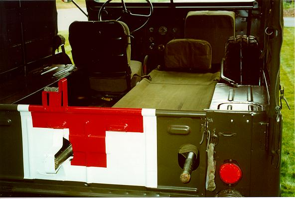
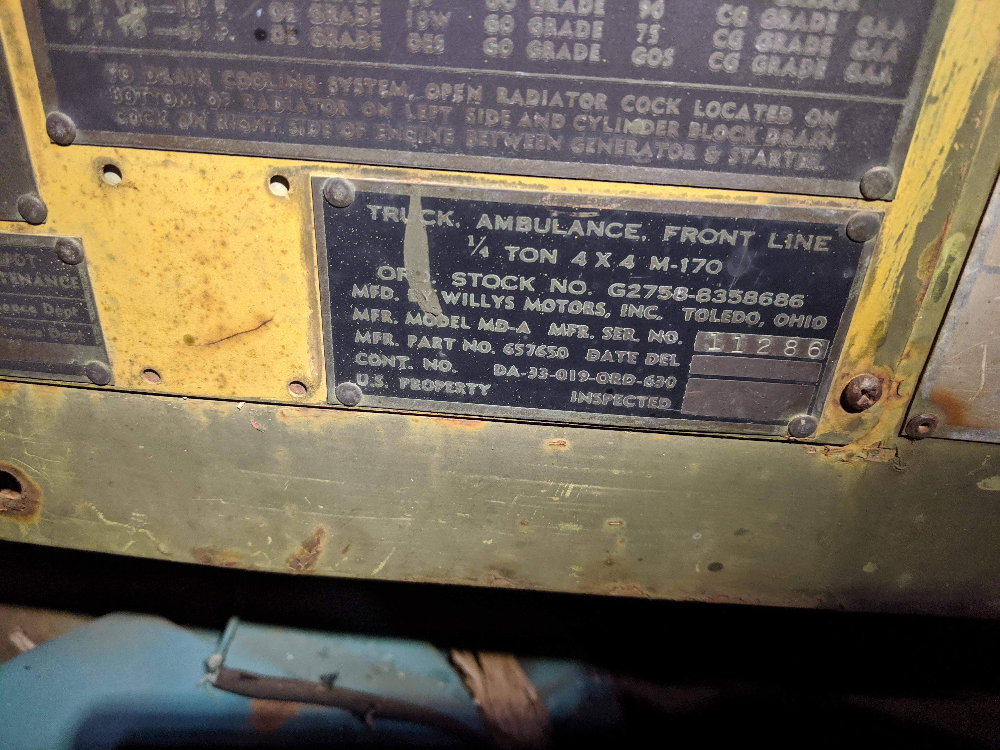

# M-170

The M-170 (MDA) is basically a stretched M38A1.
Only 4155 were produced between the mid-1950s and the early 1960s.
They were primarily used as ambulances
The production information available for these vehicles suggests a much more limited production run. 

## Drive Train

The M-170 was available with the ["Hurricane" F-Head 134 I4](/engine/factory/hurricane134.md) engine, [T-90](/transmission/factory/t90.md) 3 speed transmission, [Dana 18](/xfer/factory/d18.md) transfer case, [Dana 25](/axle/factory/d25.md) front axle, and [Dana 44](/axle/factory/d44.md) rear axle. 

## Production Information

| Year | Serial Number Range | Production |
|------|---------------------|------------|
| 1953 | 10001 - xxx         | ppp        |
| 1954 | xxx - xxx           | ppp        |
| 1955 | xxx - 12271         | ppp        |

## Additional Information

M-170 tailgate has holes in it for the stretcher

The following M-170 is somewhat modified and was a radio Jeep instead of an ambulance, but it has the tailgate holes.
The "roll bar" is not stock.

