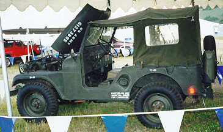
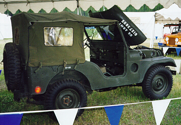

# M38A1

The M38A1 (MD) was built from 1952 until 1957 for the U.S. military forces and from 1958 until 1971 for export to foreign governments. The production information available for these vehicles suggests a much more limited production run. The M38A1 was so well liked, they introduced the CJ-5 in 1955 based on its design.

## Drive Train

The M38A1 used the ["Hurricane" F-Head 134 I4](../engine/factory/hurricane134.md) engine, [T-90](../transmission/factory/t90.md) 3 speed transmission, [Dana 18](../xfer/factory/d18.md) transfer case, either the [Dana 25](../axle/factory/d25.md) or the [Dana 27](../axle/factory/d27.md) front axle, and [Dana 44](../axle/factory/d44.md) rear axle.

## Production Information

| Year | Serial Number Range | Production |
|------|---------------------|------------|
| 1952 | 10001 - xxx         | ppp        |
| 1953 | xxx - xxx           | ppp        |
| 1954 | xxx - xxx           | ppp        |
| 1955 | xxx - 85428         | ppp        |
| 1956 | 10001 - 11000       | 1000       |

Units built in 1956 were shipped to Egypt.