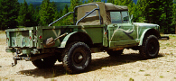

# M715 and M725

The design of the M715 was based on the J-Series civilian pickup. It was produced from 1967 until 1969. The M725 had the same drive train and nose, but a different cab/cargo area. The M725 was used as an ambulance. Both trucks were rated at 1 1/4 ton.

## Drive Train

### Engine

The M715 and M725 used the ["Tornado" 230 I6](../engine/factory/tornado230.md) engine.

### Transmission

### Transfer Case

### Front Axle

### Rear Axle

## Production Information

| Year | Serial Number Range | Production |
|------|---------------------|------------|
| 1967 | xxx - xxx           | ppp        |
| 1968 | xxx - xxx           | ppp        |
| 1969 | xxx - xxx           | ppp        |