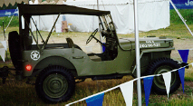
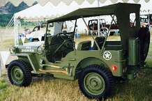

# MA, MB, and GPW
 
 

The MA was the prototype that won Willys the contract with the U.S. Government. Willys built approximately 1550 of them in 1941. From late 1941 until mid 1945, Willys built MBs and Ford built GPWs based on the Willys design. 

The first 25,808 MBs produced by Willys used a "slat grill". This grill was welded together rather than the stamped grill most people are familiar with. Very few "slat grill" MBs remain in existence. 

 

## Drive Train

The MA, MB, and GPW used the ["Go Devil" L-head 134 I4](/engine/factory/godevil134.md) engine, [T-84](/transmission/factory/t84.md) 3 Speed manual transmission, [Dana 18](/xfer/factory/d18.md) two speed transfer case, [Dana 25](/axle/factory/d25.md) front axle, and [Dana 23-2](/axle/factory/s23.md) rear axle. 

## Production Information

### MA

| Year | Serial Number Range | Production |
|------|---------------------|------------|
| 1941 | 78401 - 79900       | 1500       |   
| 1941 | 85501 - 85550       | 50         |   
  
### MB

| Year | Serial Number Range | Production |
|------|---------------------|------------|
| 1941 | 100001 - 108598     | 8598       |   
| 1942 | 108599 - 200022     | 91424      |   
| 1943 | 200023 - 293232     | 93210      |   
| 1944 | 293233 - 402334     | 109102     |   
| 1945 | 402335 - 459851     | 57517      |   
  
### GPW

| Year | Serial Number Range | Production |
|------|---------------------|------------|
| 1942 | \-                  | ?          |   
| 1943 | \-                  | ?          |   
| 1944 | \-                  | ?          |   
| 1945 | \-                  | ?          |   
  
Serial numbers are located on the left front of the frame and on the back of the bumper. The engine number was located at the front of the engine block on the water pump boss.