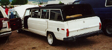
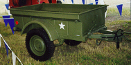

# Jeep Oddities and Accessories

## Grand Wagoneer Limo

 

The Grand Wagoneer Limo.

  

## Drive Train

### Engine

### Transmission

### Transfer Case

### Front Axle

### Rear Axle

## Production Information

| Year | Serial Number Range | Production |
|------|---------------------|------------|
| 1981 | ? - ?               | 2360       |

### Identification

Serial numbers are located on the ...

## MBT Trailer

 

The MBT trailer. Willys-Overland build some of these trailers as did other manufactures. The post war model is the M100, which looks almost identical. The M416 looks very similar to, but it has squared off fenders. They are all 1/4 ton trailers.

## Drive Train

## Production Information

| Year | Serial Number Range | Production |
|------|---------------------|------------|
| 1943 | ? - ?               | ppp        |

### Identification

Serial numbers are located on the ...

## CJ-V35

The CJ-V35 is a special radio Jeep built for the Navy in 1950. It is based on the CJ-3A. 

## Drive Train

## Production Information

| Year | Serial Number Range | Production |
|------|---------------------|------------|
| 1950 | 10001 - 11000       | 1000       |

### Identification

Serial numbers are located on the ...