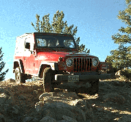

# Wrangler TJ

 

The Wrangler (TJ) was introduced in mid 1996 as a 1997 model. 

Check out Todd Murray's [ TJ FAQ](https://www.visi.com/~tam/tjfaq.md). Also, check out Larry Soo's most excellent [Wrangler (YJ)](https://www.bc4x4.com/faqs/yj.asp) FAQ. 

## Drive Train

The TJ comes with the [2.5L](/engine/factory/amc150.md) engine standard and the [4.0L](/engine/factory/amc242.md) optionally. The [AX-5](/transmission/factory/ax5.md) is used with the 2.5L engine and the [AX-15](/transmission/factory/ax15.md) is used with the 4.0L engine. Two 3 speed automatics are optional, the TF 904 comes with the 2.5L engine and the TF 999 comes with the 4.0L engine. The [NP-231](/xfer/factory/np231.md) (or NV for New Venture) transfer case comes with all models. The front axle is a reverse cut [Dana 30](/axle/factory/d30.md) and the rear axle is a [Dana 35c](/axle/factory/d35c.md) and the [Dana 44](/axle/factory/d44.md) is the optional rear axle. 

## Production Information

| Year | Serial Number Range | Production |
|------|---------------------|------------|
| 1997 | xxx - xxx           | ppp        |
| 1998 | xxx - xxx           | ppp        |

### Serial Number Locations

Serial numbers are located on the . . .