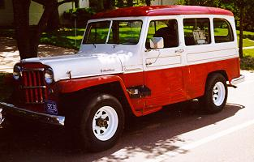
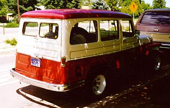

# Willys Wagon

The Station and Delivery Wagons were produced from 1946 through 1965.

### Variations

| Model                          | Basic Variations                                                   |
|--------------------------------|--------------------------------------------------------------------|
| Jeep Station Wagon (2WD)       | None                                                               |
| Jeep 4x4 Utility Wagon         | Utility Wagon; Cowl and Windshield; Flat Faced Cowl                |
| Jeep Panel Delivery (2WD, 4WD) | Panel Delivery 2WD; Flat Faced Cowl; Cowl and Windshield; Traveler |

### Specifications

| Specification | Value                              |
|---------------|------------------------------------|
| Wheelbase     | 104"                               |
| Length        | 174"                               |
| Width         | 68" (SD), 72" (SW)                 |
| Height        | 72"                                |
| Front Tread   | 57"                                |
| Rear Tread    | 57"                                |
| Gross Weight  | 4500 lbs (except 4x2 SW: 4300 lbs) |

#### Curb Weights

| Year | Model         | Curb Weight |
|------|---------------|-------------|
| 1949 | 4x2 SW        | 2898 lbs    |
| 1963 | 6-230 4x4 UW  | 3345 lbs    |
| 1963 | 6-230 4x4 UD  | 3147 lbs    |
| 1963 | F4-134 4x4 UW | 3228 lbs    |
| 1963 | F4-134 4x4 UD | 3030 lbs    |
| 1963 | 6-230 4x2 UW  | 3106 lbs    |
| 1963 | 6-230 4x2 UD  | 2998 lbs    |
| 1963 | F4-134 4x2 UW | 2993 lbs    |
| 1963 | F4-134 4x2 UD | 2881 lbs    |

### Historical Notes & Items of Interest

Willys do Brazil was producing 2wd and 4wd Station Wagons called the Rural in 1960. The Rural had a different front fenders, hood, grille, and taillights. Brooks Stevens contributed to their unique front end appearance.

## Drive Train

### Engine

### Transmission

### Transfer Case

### Front Axle

### Rear Axle

## Production Information

| YEAR                 | BODY                        | MODEL   | START  | END                         | UNITS                       |
|----------------------|-----------------------------|---------|--------|-----------------------------|-----------------------------|
| 1946                 | 463                         |         | 10001  | 16534                       | 6534                        |
| 1947                 | 463                         |         | 16535  | 44050                       | 27515[(14)](../history/index.md#14) |
| 1948                 | 463 (Inc VJ2)               |         | 44051  | 84825                       | 40774[(14)](../history/index.md#14) |
| 663                  |                             | 10001   | 13607  | 3607                        |                             |
| 1949                 | 463 (Inc VJ2)               |         | 84826  | 107895                      | 23069[(14)](../history/index.md#14) |
| 4x463 SW             |                             | 10001   | 14472  | 4472                        |                             |
| 663                  |                             | 13608   | 23614  | 10006[(14)](../history/index.md#14) |                             |
| 1950                 | 4x463 SW                    |         | 14473  | 17559                       | 3086[(14)](../history/index.md#14)  |
| 463                  |                             | 107896  | 112402 | 4506[(14)](../history/index.md#14)  |                             |
| 4x473 SW-SD          |                             | 10001   | 12450  | 2450                        |                             |
| 473 SW-SD            |                             | 10001   | 29616  | 19616                       |                             |
| 663                  |                             | 23615   | 25937  | 2322[(14)](../history/index.md#14)  |                             |
| 673 SW               |                             | 10001   | 17931  | 7931                        |                             |
| 1951                 | 4x473 SW                    | 451 FA1 | 10001  | 21854                       | 11854                       |
| 473 SW               | 451 AA1                     | 10001   | 25906  | 15906                       |                             |
| 473 SD               | 451 CA1                     | 10001   | 10003  | 3                           |                             |
| 2x473 SW             | 451 HA1                     | 10001   | 10630  | 630                         |                             |
| 2x473 SD             | 451 JA1                     | 10001   | 10135  | 135                         |                             |
| 673 SW               | 651 AA1                     | 10001   | 18470  | 8470                        |                             |
| 1952                 | 4x475 SW&SD                 | 452 FA2 | 10001  | 15683                       | 5683                        |
| 475 SW               | 452 AA2                     | 10001   | 14277  | 4277                        |                             |
| 2x475 SW             | 452 HA2                     | 10001   | 10018  | 18                          |                             |
| 473 SD               | 452 CA1                     | 10001   | 12091  | 2091                        |                             |
| 685 SW               | 652 AA2                     | 10001   | 13709  | 3709                        |                             |
| 1953                 | 4x475 SW                    | 453 FA2 | 10001  | 20631                       | 10631                       |
| 4x475 SD             | 453 RA2                     | 10001   | 10992  | 992                         |                             |
| 475 SW               | 453 AA2                     | 10001   | 14747  | 4747                        |                             |
| 475 SD               | 453 CA2                     | 10001   | 12347  | 2347                        |                             |
| 2x475 SD             | 453 JA2                     | 10001   | 10094  | 94                          |                             |
| 685 SW               | 653 AA2                     | 10001   | 17533  | 7533                        |                             |
| 1954                 | 4x475 SW                    | 454 FA2 | 10001  | 13528                       | 3528                        |
| 4x475 SD             | 454 RA2                     | 10001   | 10288  | 288                         |                             |
| 475 SW               | 454 AA2                     | 10001   | 10188  | 188                         |                             |
| 475 SD               | 454 CA2                     | 10001   | 10148  | 148                         |                             |
| 2x475 SD (Post Off.) | 454 JA3                     | 10001   | 10100  | 100                         |                             |
| 6-226 4x4 SW         | 654 FA2                     | 10001   | 12645  | 2645                        |                             |
| 6-226 4x4 SD         | 454 RA2                     | 10001   | 10219  | 219                         |                             |
| 685 SW               | 654 AA2[(7)](../history/index.md#7) | 10001   | 10945  | 945                         |                             |
| 685 SD               | 654 CA2                     | 10001   | 10308  | 308                         |                             |
| 1955                 | 475 4x4 SW                  | 54148   | 10001  | 11275                       | 1275                        |
| 475 4x4 SD           | 54248                       | 10001   | 10174  | 174                         |                             |
| 475 4x4 C/WS         | 54548                       | 10001   | 10006  | 6                           |                             |
| 475 SW               | 54747                       | 5001    | 10098  | 98[(8)](../history/index.md#8)      |                             |
| 475 SD               | 54847                       | 5001    | 10098  | 98[(8)](../history/index.md#8)      |                             |
| 475 2x4 SW           | 54147                       | 10001   | 10070  | 70                          |                             |
| 475 2x4 SD           | 54247                       | 10001   | 10084  | 84                          |                             |
| 6-226 4x4 SW         | 54168                       | 5001    | 18095  | 13095                       |                             |
| 6-226 4x4 SD         | 54268                       | 5001    | 10890  | 5890                        |                             |
| 6-226 4x4 ST CH      | 54668                       | 10001   | 10002  | 2                           |                             |
| 6-226 4x4 FFC        | 54468                       | 10001   | 10003  | 3                           |                             |
| 6-226 4x4 C/WS       | 54568                       | 10001   | 10001  | 1                           |                             |
| 6-226 4x4 AMB        | 54068-03                    | 10001   | 10005  | 5                           |                             |
| 6-226 2x4 SW         | 54167                       | 10001   | 10845  | 845                         |                             |
| 6-226 2x4 SD         | 54267                       | 10001   | 10226  | 226                         |                             |
| 6-226 2x4 ST CH      | 54667                       | 10001   | 10001  | 1                           |                             |
| 6-226 2x4 AMB        | 54067-03                    | 10001   | 10001  | 1                           |                             |
| 6-226 2x4 AMB        | 54067-04                    | 10001   | 10001  | 1                           |                             |
| 685 2x4 SW           | 54127                       | 10001   | 10108  | 108                         |                             |
| 685 2x4 SD           | 54227                       | 10001   | 10096  | 96                          |                             |
| 685 SW               | 54727                       | 5001    | 11093  | 6093                        |                             |
| 685 SD               | 54827                       | 5001    | 10309  | 5309                        |                             |
| 1956                 | 475 4x4 SW                  | 54148   | 11276  | 12940                       | 1664                        |
| 475 4x4 SD           | 54248                       | 10175   | 10397  | 222                         |                             |
| 475 4x4 FFC          | 54448                       | 10001   | 10001  | 1                           |                             |
| 475 4x4 C/WS         | 54548                       | 10007   | \---   | 0                           |                             |
| 475 4x4 AMB          | 54048-03                    | 10001   | 10028  | 28                          |                             |
| 475 2x4 SW           | 54147                       | 10071   | 10395  | 324                         |                             |
| 475 2x4 SD           | 54247                       | 10085   | 10576  | 491                         |                             |
| 475 2x4 ST CH        | 54647                       | 10001   | 10001  | 1                           |                             |
| 475 2x4 AMB          | 54047                       | 10001   | 10004  | 4                           |                             |
| 6-226 4x4 SW         | 54168                       | 18096   | 25335  | 7239                        |                             |
| 6-226 4x4 SD         | 54268                       | 10891   | 11650  | 757                         |                             |
| 6-226 4x4 ST CH      | 54668                       | 10003   | \---   | 0                           |                             |
| 6-226 4x4 FFC        | 54468                       | 10004   | \---   | 0                           |                             |
| 6-226 4x4 C/WS       | 54568                       | 10002   | \---   | 0                           |                             |
| 6-226 4x4 AMB        | 54068-03                    | 10006   | 10013  | 8                           |                             |
| 6-226 4x4 AMB        | 54068-04                    | 10001   | 10003  | 3                           |                             |
| 6-226 4x4 RT         | 54068-07                    | 10001   | 10002  | 2                           |                             |
| 6-226 2x4 SW         | 54167                       | 10846   | 12190  | 1344                        |                             |
| 6-226 2x4 SD         | 54267                       | 10227   | 10600  | 373                         |                             |
| 6-226 2x4 AMB        | 54067-03                    | 10002   | 10002  | 1                           |                             |
| 6-226 2x4 AMB        | 54067-04                    | 10002   | 10002  | 1                           |                             |
| 1957                 | 475 4x4 SW                  | 54148   | 12941  | 14250                       | 1310                        |
| 475 4x4 SD           | 54248                       | 10398   | 10679  | 282                         |                             |
| 475 4x4 FFC          | 54448                       | 10002   | 10004  | 3                           |                             |
| 475 4x4 AMB          | 54048-03                    | 10029   | 10061  | 32                          |                             |
| 475 2x4 SW           | 54147                       | 10396   | 10930  | 535[(5)](../history/index.md#5)     |                             |
| 475 2x4 SD           | 54247                       | 10577   | 11006  | 430[(5)](../history/index.md#5)     |                             |
| 475 2x4 ST CH        | 54647                       | 10002   | 10003  | 2[(5)](../history/index.md#5)       |                             |
| 475 2x4 AMB          | 54047-03                    | 10001   | 10007  | 7[(5)](../history/index.md#5)       |                             |
| 6-226 4x4 SW         | 54168                       | 25336   | 32699  | 7364                        |                             |
| 6-226 4x4 SD         | 54268                       | 11651   | 12230  | 580[(12)](../history/index.md#12)   |                             |
| 6-226 4x4 FFC        | 54468                       | 10004   | 10004  | 1                           |                             |
| 6-226 4x4 AMB        | 54068-03                    | 10014   | 10034  | 21                          |                             |
| 6-226 4x4 RT         | 54068-07                    | 10003   | 10009  | 7                           |                             |
| 6-226 2x4 SW         | 54167                       | 12191   | 14667  | 2477                        |                             |
| 6-226 2x4 SD         | 54267                       | 10601   | 10838  | 238                         |                             |
| 6-226 2x4 AMB        | 54067-03                    | 10003   | 10006  | 4                           |                             |
| 1958                 | 475 4x4 SW                  | 54148   | 14251  | 14743                       | 493                         |
| 475 4x4 SD           | 54248                       | 10680   | 10939  | 259[(14)](../history/index.md#14)   |                             |
| 475 4x4 AMB          | 54048-03                    | 10062   | 10070  | 8[(14)](../history/index.md#14)     |                             |
| 475 2x4 SW           | 54147                       | 10931   | 11200  | 69[(14)](../history/index.md#14)    |                             |
| 475 2x4 SD           | 54247                       | 11007   | 11425  | 418[(14)](../history/index.md#14)   |                             |
| 475 2x4 ST CH        | 54647                       | 10104   | 10163  | 60                          |                             |
| 475 2x4 AMB          | 54047-03                    | 10008   | 10008  | 1                           |                             |
| 6-226 4x4 SW         | 54168                       | 32700   | 39196  | 6497                        |                             |
| 6-226 4x4 SD         | 54268                       | 12231   | 12766  | 536                         |                             |
| 6-226 4x4 AMB        | 54068-03                    | 10035   | 10051  | 16[(14)](../history/index.md#14)    |                             |
| 6-226 4x4 RT         | 54068-07                    | 10010   | 10012  | 2[(14)](../history/index.md#14)     |                             |
| 6-226 2x4 SW         | 54167                       | 14668   | 15252  | 585                         |                             |
| 6-226 2x4 SD         | 54267                       | 10839   | 11038  | 200                         |                             |
| 6-226 2x4 AMB        | 54067-03                    | 10007   | 10010  | 4                           |                             |
| 1959                 | 475 4x4 SW                  | 54148   | 14744  | 16095                       | 1352                        |
| 475 4x4 SD           | 54248                       | 10940   | 11079  | 140                         |                             |
| 475 4x4 AMB          | 54048-03                    | 10071   | 10133  | 63                          |                             |
| 475 2x4 SW           | 54147                       | 11201   | 11441  | 241                         |                             |
| 475 2x4 SD           | 54247                       | 11426   | 11861  | 436                         |                             |
| 475 2x4 ST CH        | 54647                       | 10164   | 10266  | 103                         |                             |
| 475 2x4 AMB          | 54047-03                    | 10008   | 10009  | 2                           |                             |
| 6-226 4x4 SW         | 54168                       | 39197   | 47362  | 8165[(14)](../history/index.md#14)  |                             |
| 6-226 4x4 SD         | 54268                       | 12767   | 13316  | 550                         |                             |
| 6-226 4x4 FFC        | 54468                       | 10004   | 10004  | 1                           |                             |
| 6-226 4x4 AMB        | 54068-03                    | 10052   | 10096  | 45                          |                             |
| 6-226 4x4 RT         | 54068-07                    | 10013   | 10014  | 2                           |                             |
| 6-226 4x4 AVA        | 54068-09                    | 10021   | 10060  | 40                          |                             |
| 6-226 2x4 SW         | 54167                       | 15253   | 15602  | 350                         |                             |
| 6-226 2x4 SD         | 54267                       | 11039   | 11276  | 238                         |                             |
| 6-226 2x4 AMB        | 54067-03                    | 10010   | 10041  | 32                          |                             |
| 6-226 2x4 FFC        | 54467                       | 10001   | 10001  | 1                           |                             |
| 1960                 | 475 4x4 SW                  | 54148   | 16096  | 17270                       | 1175                        |
| 475 4x4 SD           | 54248                       | 11080   | 11206  | 127                         |                             |
| 475 4x4 AMB          | 54048-03                    | 10134   | 10226  | 93                          |                             |
| 475 2x4 SW           | 54147                       | 11441   | 11496  | 56                          |                             |
| 475 2x4 SD           | 54247                       | 11861   | 12344  | 484                         |                             |
| 475 2x4 ST CH        | 54647                       | 10266   | 10355  | 90                          |                             |
| 475 2x4 FFC          | 54447                       | 10001   | 10202  | 202                         |                             |
| 6-226 4x4 SW         | 54168                       | 47363   | 56330  | 8968                        |                             |
| 6-226 4x4 SD         | 54268                       | 13317   | 14562  | 1246                        |                             |
| 6-226 4x4 AMB        | 54068-03                    | 10097   | 10204  | 108                         |                             |
| 6-226 4x4 AMB        | 54068-04                    | 10004   | 10004  | 1                           |                             |
| 6-226 4x4 AVA        | 54068-09                    | 10061   | 10111  | 51                          |                             |
| 6-226 4x4 Traveler   | 54268-14                    | 10001   | 10112  | 112                         |                             |
| 6-226 2x4 SW         | 54167                       | 15602   | 15681  | 80                          |                             |
| 6-226 2x4 SD         | 54267                       | 11276   | 11693  | 418                         |                             |
| 6-226 2x4 C/WS       | 54567                       | 10001   | 10073  | 73                          |                             |
| 6-226 2x4 Traveler   | 54267-14                    | 10001   | 10102  | 102                         |                             |
| 1961                 | 475 4x4 SW                  | 54148   | 17271  | 18110                       | 840[(21)](../history/index.md#21)   |
| 475 4x4 SD           | 54248                       | 11207   | 11762  | 556[(21)](../history/index.md#21)   |                             |
| 475 4x4 AMB          | 54048-03                    | 10227   | 15281  | 55[(21)](../history/index.md#21)    |                             |
| 474 4x4 Traveler     | 54348                       | 10001   | 10005  | 5[(21)](../history/index.md#21)     |                             |
| 475 2x4 SD           | 54247                       | 12345   | 12557  | 213[(21)](../history/index.md#21)   |                             |
| 475 2x4 FFC          | 54447                       | 10202   | 10202  | 1[(21)](../history/index.md#21)     |                             |
| 6-226 4x4 SW         | 54168                       | 56331   | 64238  | 7908[(21)](../history/index.md#21)  |                             |
| 6-226 4x4 SD         | 54268                       | 14562   | 15310  | 749[(21)](../history/index.md#21)   |                             |
| 6-226 4x4 ST CH      | 54668                       | 10101   | 10101  | 1[(21)](../history/index.md#21)     |                             |
| 6-226 4x4 C/WS       | 54568                       | 10101   | 10190  | 90[(21)](../history/index.md#21)    |                             |
| 6-226 4x4 AMB        | 54068-03                    | 10205   | 10327  | 123[(21)](../history/index.md#21)   |                             |
| 6-226 4x4 AVA        | 54068-09                    | 10112   | 10167  | 56[(21)](../history/index.md#21)    |                             |
| 6-226 4x4 Traveler   | 54368                       | 10001   | 10014  | 14[(21)](../history/index.md#21)    |                             |
| 6-226 2x4 SD         | 54267                       | 11694   | 19144  | 251[(21)](../history/index.md#21)   |                             |
| 6-226 2x4 AMB        | 54067-03                    | 10042   | 10116  | 75[(21)](../history/index.md#21)    |                             |
| 6-226 2x4 C/WS       | 54567                       | 10074   | 10124  | 51[(21)](../history/index.md#21)    |                             |
| 6-226 2x4 Traveler   | 54367                       | 10001   | 10004  | 4[(21)](../history/index.md#21)     |                             |
| 1962                 |                             |         |        |                             |                             |
| 1963                 |                             |         |        |                             |                             |
| 1964                 |                             |         |        |                             |                             |
| 1965                 |                             |         |        |                             |                             |

### Special Wagons

| 1958                                         | 475 2x4 Maverick                           | 58147 | 10001 | 10100                     | 100                                              |
|----------------------------------------------|--------------------------------------------|-------|-------|---------------------------|--------------------------------------------------|
| 1959                                         | 475 2x4 Maverick                           | 58147 | 10101 | 12654                     | 2553[(14)](../history/index.md#14)                       |
| 475 2x4 El Goucho                            | 58547                                      | 10001 | 10003 | 3[(14)](../history/index.md#14)   |                                                  |
| 6-226 2x4 Maverick                           | 58167                                      | 10001 | 10130 | 130                       |                                                  |
| 1960                                         | 475 2x4 SW Face Lift[(18)](../history/index.md#18) | 58147 | 12655 | 15220                     | 2566                                             |
| 6-226 2x4 SW Face Lift[(18)](../history/index.md#18) | 58167                                      | 10130 | 11097 | 968                       |                                                  |
| 1961                                         | 475 2x4 Maverick                           | 58147 | 15221 | 16422                     | 1202[(19)](../history/index.md#19)[(21)](../history/index.md#21) |
| 6-226 2x4 Maverick                           | 58167                                      | 11098 | 11473 | 376[(21)](../history/index.md#21) |                                                  |

### Later Production Information

1962
-
1965 |  6-230 4x4 Station Wagon (Utility Wagon)
6-230 4x2 Sedan Delivery (Utility Delivery)
6-230 4x4 Sedan Delivery (Utility Delivery)
6-230 4x4 Flat Face Cowl
6-230 4x4Cowl and Windshield
6-230 4x4 Stripped Chassis
6-230 4x2 Station Wagon (Utility Wagon) |  54178-10001 and up
54277-10001 and up
54278-10001 and up
54478-10001 and up
54578-10001 and up
54678-10001 and up
58177-10001 and up

| ***
---|---|---|---
* The VJ-2 is included in this serial number range.
** Serial numbers consecutive with 1955 production.
*** Production data not available.

### Serial Number Locations

Serial numbers are located on the identification plate located near the bottom rear of the left-hand door frame.

* F-Head "Hurricane" I4 134 - Located on tap water pump boss at upper front end of cylinder block.
* L-Head I6 226 - Located near left front corner of cylinder block above generator.
* OHC "Tornado" I6 230 - Located near lower front right corner of cylinder block.