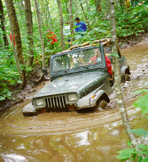

# Wrangler YJ

The Wrangler (YJ) was produced from 1987 until 1995.

Larry Soo's most excellent [Wrangler (YJ)](https://www.bc4x4.com/faqs/yj.asp) FAQ.

## Drive Train

### Engine

The YJ came with the [AMC 2.5L I4](../engine/factory/amc150.md) engine standard and the [AMC 4.2L(258) I6](../engine/factory/amc258.md) optionally until '89. In 1990, the [4.0L I6](../engine/factory/amc242.md) was introduced.

### Transmission

The [AX-5](../transmission/factory/ax5.md) and [BA 10/5](../transmission/factory/ba10.md) were used with the I4 and I6. The [BA 10/5](../transmission/factory/ba10.md) was discontinued in mid-1989, and the [AX-15](../transmission/factory/ax15.md) was used with the 4.2L I6 and 4.0L ever after. The TF 904 3-speed automatic was used with the I4, and the TF 999 was used with the I6 engines.

### Transfer Case

The [NP-207](../xfer/factory/np207.md) was used in 1987. After 1987, the [NP-231](../xfer/factory/np231.md) was used.

### Front Axle

A reverse cut [Dana 30](../axle/factory/04-d30.md) was used as the front axle in the YJ.

### Rear Axle

The factory only used the [Dana 35c](../axle/factory/03-d35c.md) in the rear of the YJ.

## Production Information

| Year | Serial Number Range | Production |
|------|---------------------|------------|
| 1987 | xxx - xxx           | ppp        |
| 1988 | xxx - xxx           | ppp        |
| 1989 | xxx - xxx           | ppp        |
| 1990 | xxx - xxx           | ppp        |
| 1991 | xxx - xxx           | ppp        |
| 1992 | xxx - xxx           | ppp        |
| 1993 | xxx - xxx           | ppp        |
| 1994 | xxx - xxx           | ppp        |
| 1995 | xxx - xxx           | ppp        |

### Serial Number Locations

Serial numbers are located on the . . .