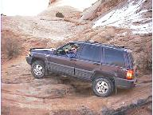

# Jeep Grand Cherokee (ZJ)

 

## Description

The Grand Cherokee (ZJ) has been produced since 1993. 

## Drive Train

### Engine

The ZJ comes with the [4.0L I6](/engine/factory/amc242.md) engine standard and the [5.2L V8](/engine/factory/d318.md) optionally. In 1998, the [5.9L V8](/engine/factory/d360.md) was also an option. In 1999, the [4.7L V8](/engine/factory/d287.md) will be an option. 

### Transmission

The [AX-15](/transmission/factory/ax15.md) is the 5 speed manual transmission used in the ZJ. 

Information on automatic transmissions will be added later. 

### Transfer Case

The [NP-231](/xfer/factory/np231.md) (or NV for New Venture) is the Command-Trac transfer case used in the ZJ. Information on the other transfer cases will be added later. 

### Front Axle

The [Dana 30](/axle/factory/d30.md) is the front axle used in the ZJ. 

### Rear Axle

The [Dana 35c](/axle/factory/d35c.md) is the axle most commonly found in the rear of the ZJ. The [Dana 44](/axle/factory/d44.md) is optional in some models. 

## Production Information

| Year | Serial Number Range | Production |
|------|---------------------|------------|
| 1993 | xxx - xxx           | ppp        |
| 1994 | xxx - xxx           | ppp        |
| 1995 | xxx - xxx           | ppp        |
| 1996 | xxx - xxx           | ppp        |
| 1997 | xxx - xxx           | ppp        |

### Serial Number Locations

Serial numbers are located on the . . .