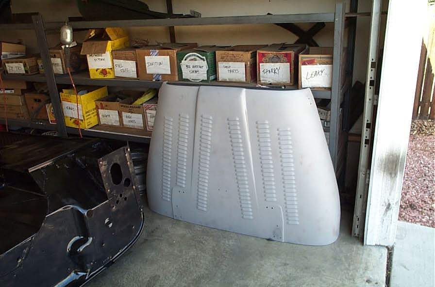

# Deep CJ-6: Day Three on Body Work*Short Cuts
By: Terry L. Howe - 4/2003

The underside of the tub painted black so the ugliness is less visible.

The hood came out real nice. I had it louvered years ago for this project. It was originally the hood for my '81 CJ-7, my second Jeep.

First thing in the morning, I hit the battery tray and part of the bottom of the tub with rattle can black. The rust converter needs time to set up, so you cannot paint it right away.

I had to cut some sheet metal to clear for exhaust and fuel lines. I also welded in some expanded metal in the gap between the floor and the wheel well. I figure this will make some great storage space for rarely used tools and parts. It will also eliminate that hole so I'll be less likely to get hung up on a rock there, not that I plan to wheel this rig hard, but you never know.

Diane helped me clean the oil of the firewall with laquer thinner, wire wheel it, and spay with rust conveter. We both rattle canned the bottom of the tub with black spay paint.

Around the middle of the day, I got a call from Rock Mountain Memorial, my hood was done. I picked it up and it looked great and the price was great.