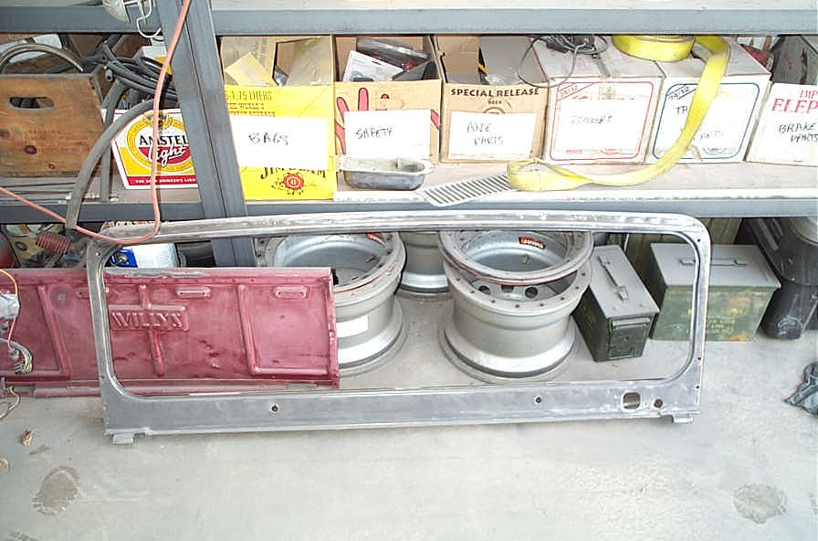

# Deep CJ-6: Day Six Bondo*Short Cuts
By: Terry L. Howe - 4/2003

A layer of Bondo dust covers the entire floor.

The windshield has been cleaned all up and sprayed with rust converter.

The morning was spent working on the windshield. The top of it was rusted pretty bad between the metal. Earlier, I'd cleaned out as much as possible and sprayed it with rust converter. To prevent future problems, I welded it all up today. After grinding, a little Bondo will smooth it all out.

There were a couple minor things I needed to do to the tub before brushing in the bed liner. I cut an access hole for the fuel sending unit so I can get to that easily. I made a cover plate for the clutch linkage hole since I installed an 700R4. I also made a bracket for the parking brake since the old one wouldn't work. The bedliner should go in as soon as the Bondo is done.

The hood was mounted and I adjusted the mounting of the windshield. Earlier, I'd painted under the hinges black so there wouldn't be bare metal under the hinges.

Nearly a quart of Bondo has been used to smooth things out. It will be wavey, but smooth. Bondo dust covers the floor and everything including myself. I've been mixing up small, hot batches and I had to go to the auto parts store covered in dust to get more hardener.