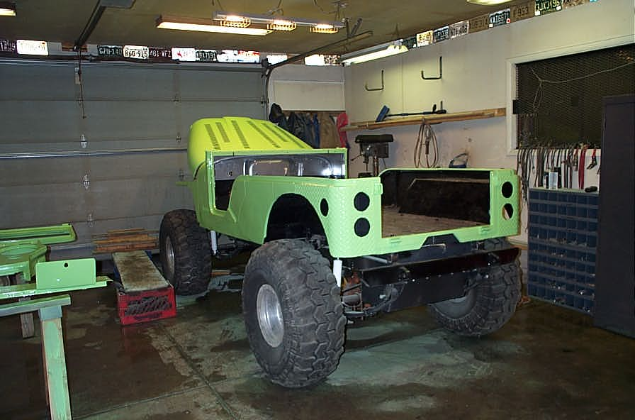

# Deep CJ-6: Day Ten Color and Clear
By: Terry L. Howe - 5/2003

Finally, no more masking!

From the front

Sunday, the day of rest, Sean and I went wheeling. So, day ten is Monday. I did do a little sanding on Sunday and shot a little color to see how it would sand out. I needed to sand all the way down to the primer or bare metal to make the color stop lifting. A good section of the hood, half of the cowl, and one fender were having problems as well as a part of the dash and grill.

Monday, I sanded everything down and wet sanded everything again. This time, I was sure to wipe everything with clean rags and use a prep solvent to wipe it down. I shot a couple coats of color over many sections to get everything to lay down nicely. I ended up using a little over 3 quarts, so it is a good thing I got the extra color, but the job could of been done with 3, I laid it on heavy.

I used Sean's HVLP to shoot it which is way easier than a normal gun. This rig costs more than I'd want to spend and it is a cheap one. I think it cost him $700 or so, but he makes money with it. It just lays the paint on much better, even a hack like myself doesn't get sags or orange peal. The only sag I got was when I had the gun set for a horizontal fan and I was thinking I was shooting a vertical fan.

Sean stopped by around 6pm after his day of work and shot the clear for me. I wanted him to shoot the clear since he has a way better technique than I have. The clear came out awesome except one spot where some foreign material shot out of the gun. Not sure where it came from, must of been some junk fell in the mixing cup. I need to sand it out and reshoot the cowl with clear only.

Other than that small problem, the rig looks great! The color seems a bit electric to me at first, but either it toned down or I'm getting used to it. Normally, rigs look a little too colorful with no hardware bolted to them.