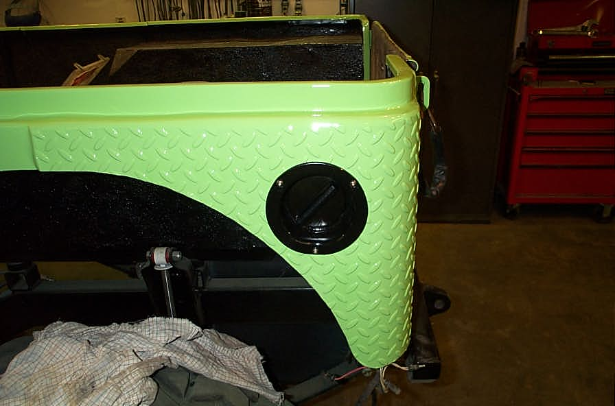

# Deep CJ-6: Day Thirteen Power Brake Conversion
By: Terry L. Howe - 5/2003

The original swing arm pedal for the CJ with the clutch pedal removed. I welded a piece of diamon plate on the pedal to make it a bit wider.

The master cylinder and booster from the '90 S-10. The booster and master cylinder clear the hood nicely.

The gas filler from a '77 CJ-7 fit on the side TJ style.

This old CJ-6 original came with manual brakes and drums all around. Even with a manual transmission, it was a lot of work to drive around town with those brakes. Since I was putting in a automatic transmission and it had to have some power brakes.

I wasn't interested in spending money to install power brakes, but fortunately, I had a lot of junk around. A couple years back, I parted out a '90 S-10 and put the 4.3L V6 in a flat fender. I still had the brake master cylinder and booster from that truck. The master cylinder had a brake anti-lock computer and solenoid attached to it as well as a proportioning valve. I took this stuff off since I already had a proportioning valve on my Jeep and I doubted I could get the anti-lock mechanism to work for my application.

The master cylinder was one of those plastic and aluminum GM master cylinders, very light and it holds a lot of fluid. It is easy to see the fluid level from the outside which is another nice feature. The booster was quite large, but not too big, is is a little over 10" in diameter. The master cylinder and booster where designed to go on a flat firewall too which helped. I had another booster and master cylinder from an '89 Firebird that was similar, but designed to go on a firewall that was not perpendicular.

The installation was pretty straightforward. I just drilled out the firewall for the booster which has a 3.5" square pattern. I cut some 3/4" round tube to make a spacer to hold the booster out 5/8". The swing arm pedal bracket also needed to be drilled for the upper two bolts of the booster. I used some 3/8" bolts through the original master cylinder holes and bolted everything together.

The rod from the booster had too small a hole from my swing arm bracket and it was too long. I cut the rod off my old master cylinder and cut the rod down from the booster. I had some 1/2&qot; round tube to sleeve the two rods together and I welded them up.

After running some brake lines, I cleaned up and bolted on a gas fillter from a '77 CJ-7 I parted out years ago. The filler was a nice round one and fit on the side Wrangler TJ style. I didn't have room for a filler on the back with the lights and all.