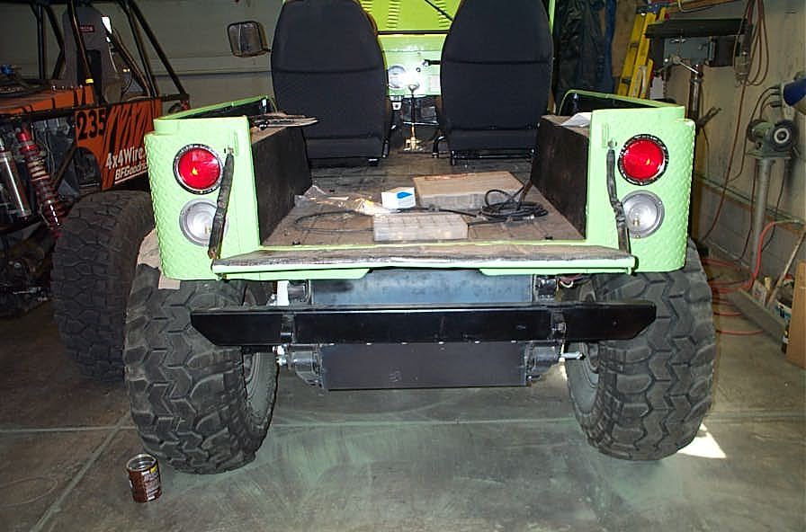

# Deep CJ-6: Day Fifteen Headlights and Tail Lights*Short Cuts
By: Terry L. Howe - 5/2003

The headlights and parking lights on the grill.

The washer tank mounted down below the master cylinder.

The horn was moved up to bolt to the grill and the relay for the horn was mounted on the fender.

Round tail lights and backup lights flush mounted to keep them from being broken.

There hasn't been much time to work on the old CJ-6 lately since I've had to prepare and go to a UROC and a RCAA competition, but a day was finally free. It was time to get some more wiring done, the headlights and the tail lights to be exact.

The original parking lights for the rig were badly rusted. Water trapped in them for years made them so badly damaged, I didn't think I could even repair them. The problem is, the parking lights on the grill of these early CJs, you just cannot find them. This early 70s CJs use a different style light than earlier or later CJs. I decided to retrofit some late CJ parking lights into the grill.

Unfortunately, the later parking lights require a larger hole and I already painted the grill before I figured this out. I carefully used my angle grinder to make the hole larger and drilled holes for the screws to attach them. They look pretty good and use the same plug as the original lights.

After the headlights and parking lights were wired up, I moved onto the rest of that wiring harness. The original horn was lost somewhere, so I wanted to wire up another. Unfortunately, the horn button grounds the circuit, so it was easiest to wire up a relay so I wouldn't have to mount the horn on a insulated bracket.

The windshield wash tank and pump needed to be moved since I'd chopped out the fenders. I ground off a bolt on the tub and drilled some holes to mount it up below the master cylinder. Some slight adjustment of the nozzle and it seems to be working well.

The original tail lights I'd dumped in favor of flush mount round lights. I'd cut the wires off the old tail lights and backup lights and soldered and shirk wrapped the new tail lights in with the same old harness. I don't have the backup switch wired up yet, but I tested the lights and they work.

The only other thing on that wiring harness was the switch for the dash brake light. It took me a while to realize what the plug was for, but only a second to plug it into the proportioning valve.