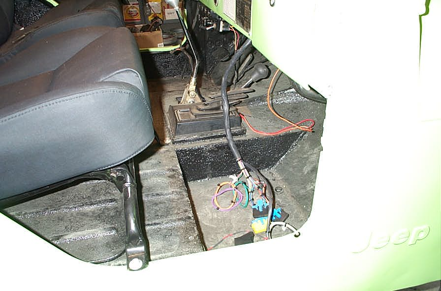

# Deep CJ-6: Day Nineteen Engine Wiring*Short Cuts
By: Terry L. Howe - 5/2003

The other side of the engine wiring harness with the plugs for the computer, the fuse panel, neutral safety switch, ALDL, check engine light, and brake wire.

New chip for the computer.

The other side of the engine wiring harness contains the plugs for the computer, the ALDL (assembly line diagnostic link), check engine light, neutral safety switch, and brake switch. I already had the computer mounted, so I just need to plug that in, but I also had to swap out the chip in the computer. I bought the chip (PROM) #16151348 for only $45 which was a great price. I removed the cover from the computer, pulled out the old Cavalier chip, and plugged in the V8 chip.

I drilled holes in the firewall to mount the ALDL and the fuse panel for the engine harness. I hooked up the neutral safety switch to my Lokar shifter on my 700R4. I can't seem to find my brake lights switch, so that will have to happen another day.

I bought a small red light for the check engine light and drilled a hole in the dash to mount it.

The check engine light comes on and the relay for the fuel pump clicks on for a couple seconds, so it appears everything is working. I still don't have fuel, so it isn't ready to fire up just yet.