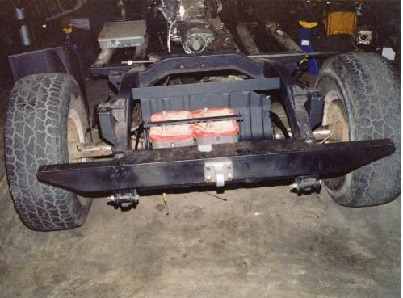
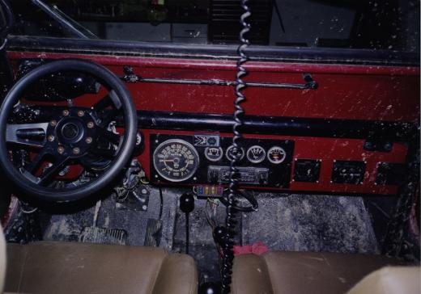
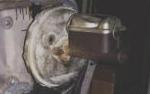
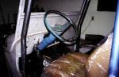
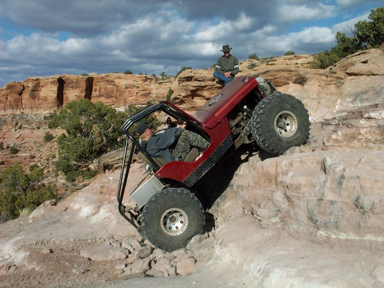
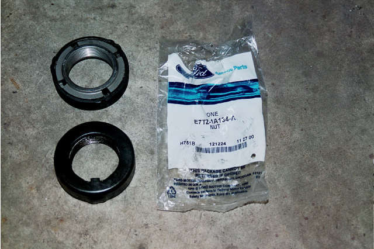

# Project Pieces and Parts - Main Page*
by: Terry L. Howe

Pieces and Parts - The starting point

Project Pieces & Parts has been a long and changing project. When the project began, I wanted to make a nice streetable CJ-2A that would perform well on the trail, but near the end I wanted to build a hard core rock crawler. The change in direction created some changes in the project in the middle of the project.

The reason for the change in direction was the slow death my '81 CJ-7. I'd been wheeling my CJ-7 harder and harder over the past eight years and the damage was very hard to keep up with. I finally decided it would be easier to scrap the CJ-7 and focus on the CJ-2A. With my energy focused on the CJ-2A, I knew I could make it a great rock crawler.

## [Introduction](/projects/piecesintro/)Considering only the condition of the Jeep, parting it out is the most reasonable thing to do. The only thing that prevents me from doing just that is its heritage. *
## [Damage Report](/projects/piecesdamage/)A complete disassembly of this flat fender revealed several problems that were not immediately apparent. The biggest problems are with the tub and the frame. *
## [Frame and Bumper Fab](/projects/piecesframe/)Fame and bumper fabrication for the Jeep Tech Editors CJ-2A Project Pieces & Parts. Ideas on building a stout flat fender frame and bumpers for a minimalist. *
## [Frame Boxing and Gusseting](/projects/piecesframe2/)The frame work for Project Pieces and Parts wasn't done after simply chopping up and splicing together the '73 Commando frame to flat fender specifications. There was still a large frame crack to fix near the front spring mount, the splices to reinforce, body mounts to build, and some frame boxing to do. *
## [Pieces & Parts Suspension](/projects/piecessusp/)Since this project is called "Pieces & Parts", you can't expect anything to be normal and this is true for the suspension. The suspension is not radical, but it is practical and should perform well. *
## [Ultimate Offset Pumpkin Dana 44](/projects/piecesrear/)Rebuilding a '71 CJ-5 Dana 44 for a Project Pieces and Parts. This axle is the best factory rear end for any '41-'71 short Jeep. *
## [Dana 30 Disk Brake Conversion](/projects/piecesfront/)Terry Howe does a disk brake conversion of a drum brake Dana 30 for Project Pieces and Parts. Everything you need to know to swap disks on your '72-'76 CJ with drum brakes. This article also explains why the Dana 30 is a good low buck axle upgrade for '45-'71 CJs. *
## [Buick 231 V6 Swap](/projects/piecesengine/)Project Pieces & Parts finally gets the fired up with a Buick 231 V6 sitting on engine mounts from Advanced Adapters. *

## [TH350 for Project Pieces & Parts](/projects/piecestrans/)The Turbo 350, aka TH350, automatic transmission is a stout 3 speed automatic transmission. It has been used in various GM cars and trucks over the years. Because it is a reliable, common, and short transmission, it is probably the best automatic transmission to swap in a short Jeep such as a flat fender. *
## [Pieces & Parts Transfer Case](/projects/piecesxfer/)Project Pieces & Parts gets a Scout 80 Dana 18 transfer case. The Scout 80 Dana 18 is a small hole Dana 18 with the big intermediate shaft. *
## [Pieces & Parts Overdrive](/projects/piecesod/)A Warn Overdrive from a Scout 80 for Project Pieces & Parts. The Warn Overdrive does not shorten the rear driveshaft and it provides a 0.75:1 gear reduction in all forward and reverse gears. *
## [Tunnel Cover](/projects/piecestunnel/)Fabricating the shift linkage bracket and tunnel cover was an entire weekend of careful cutting, bending, welding, and drilling. The work was worth it, I got the clean look I wanted and I maximized floor space. *

## [Dual Batteries for Project Pieces & Parts](/projects/piecesbattery/)It is always a challenge fitting things into a flat fender; fitting a dual battery system into Project Pieces & Parts was no exception. A dual battery system insures that there will be plenty of cold cranking amps to start the Jeep up even after a fairly long dead pull with the winch. *

## [Durabak Bed Liner](/projects/piecesdurabak/)For Project Pieces and Parts, Durabak not only provides a tough, skid resistant finish, it hides body work. Applying the product is easy, and the finish is outstanding. *
## [Body Work](/projects/piecesbody/)Body work for Project Pieces and Parts is more of a matter of turning dents and swiss cheese into some sort of usable body. Hours and hours of MIG welding, Bondo, and sanding result in nice body panels. *
## [Shooting Color](/projects/piecespaint/)Anyone will tell you that the key to a good paint job is the prep work. Body work on a Jeep is something you need to strike a delicate balance between looking good and not wasting a lot of time. *
## [Off-Your Rocker Corner Guards](/projects/piecesoyr/)Project Pieces & Parts gets rid of some ratty corners by installing Off-Your Rocker Corner Guards. These corners aren't poseur aluminum cover-ups, these corners are heavy duty steel diamond plate. *

## [Pieces & Parts Electrical](/electrical/pieces01)Wiring up a Willys CJ-2A is no simple matter. I had two stock wiring harnesses and both were beyond recovery. The cloth insulation on the wires just doesn't last 50 years or more. I recently parted out a rolled '77 CJ-7, so I decided to use the wiring harness from the CJ-7 on the Willys. It worked pretty well and saved lots of time and money. *
## [In Cab Winch Controller*](/winch/hardwire/)An in cab winch controller, hard wired to your winch, will increase the reliability of your winch and make it more convenient to use. A hard wired winch controller will avoid winch failures caused by a damaged plug or a controller wire wrapped around a tire. It also means your winch will be ready to use without digging out the controller. *

## [Pieces & Parts Brakes](/brakes/pieces01/)The stock brakes on a CJ-2A are frightening by modern day standards. They use a single cylinder master cylinder that has no redundancy and small drums all around. I wanted to have a dual cylinder master cylinder and disk brakes up front. I also wanted power brakes because I was planning on running an automatic transmission. *

## [Pieces & Parts Steering I](/steer/pieces01/)The Ross steering that is stock on a CJ-2A is basic manual steering. Because there are several moving parts in the linkage, it has a reputation for being loose. I wanted to convert my CJ-2A to Saginaw power steering. *

## [Pieces & Parts Steering II](/steer/pieces02)When I swapped a 4.3L Chevy V6 in to replace the 3.8L Buick V6, I had to rework the intermediate shaft. The Chevy engine mounts are in the middle where as the Buick mounts are in the front of the engine. The only way I could clear the engine mount was with a three u-joint intermediate shaft from Borgeson. *

## [Tube It Out!](/tech/body/tubeitout01/)There are many ways that tubing out portions of your four wheeler can improve it's off road performance. It can improve departure and approach angles, allow more engine cooling, and allow larger tires with no lift. It also looks cool. *

## [Quick Jeep Dana 44 Spindle Nut](/axle/d44nut01/)If your Jeep has half ton internal hubs, chances are you have the three piece spindle nuts. The inner nut sets the tension on the bearing, the lock washer slides down the slot on the spindle and a pin on the inner nut goes in a hole in the lock washer, and the outer nut holds it all in place. Sometimes, you get lucky and that lock washer slides right down and the pin in the nut goes right in a hole in the lock washer, sometimes it doesn't. Some Ford Dana 44s use a self locking spindle nut that does not require aligning the pin and makes installation much easier. *

## [Slamming Gears](/transmission/upgrades/QuickShifter01)An easy modification to the Art Carr cable shifter can make it a quick gear slamming shifter for any automatic transmission. Sometimes, the ability to get into reverse fast can save a roll over. *