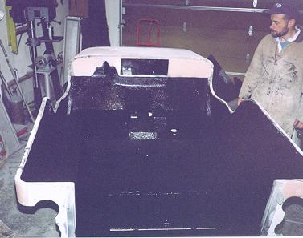

# Project Pieces and Parts - Durabak
by: Terry L. Howe

Applying the Durabak

Once the metal work and Bondo was complete, I decided it was time to apply the Durabak bed liner. The reason I applied the Durabak before painting was I figured it would be easier to touch up the Durabak than the paint. I also figured the Durabak would stick better to bare metal rather than paint that hadn't had a chance to cure yet.

The reason I wanted to use the Durabak was obviously for it's skid resistant and tough finish, but also because it would hide the work I'd done to the tub and give a more finished look. Doing body work on a Jeep is fairly easy, but both sides of the work are often exposed. I had a number of patches welded into various body panels and it was looking great on the outside, but not as great on the inside of the tub.

## Prep Work

A respirator and disposable clothing are a good idea

It is much more pleasant to apply the Durabak with the right protective gear. Durabak is very sticky and if you get some on your skin, it will be several days before you get it off. Latex gloves and throw away clothes are an excellent idea. Respirators are also an excellent idea, especially if you are working in a garage without much ventilation.

My buddy Sean helped me apply the Durabak. Sean is a professional painter, so he is familiar with the best techniques for applying various types of materials and he had already Durabaked the interior of his '76 Bronco. The picture of on the right is of Sean mixing up the Durabak.

Before we actually applied the Durabak, I scuffed up all the smooth surfaces with a 36 grit sand paper. This took very little time since most of my Jeep had been sand blasted. After scuffing everything up, I used a degreaser to clean up all the surfaces. A few things, such as screw heads, were masked out with tape so they could be removed in the future.

## Application

Sean recommended using only brushes to apply the Durabak to give it the smoothest possible finish. The roller gives the Durabak a coarser finish. In order to avoid brush lines a wavy motion was used with the brush. The material can be smoothed out even more if it is worked with the brush while it is setting up. Since it applied with a brush, it can really be worked in where it might be hard to get a spray on bed liner.
We applied the Durabak to the inside of the tub, on the inside of tailgate, under the front fenders, and under the rear fender wells. In the fender wells, it should help reduce road noise and protect them from rocks. After the first coat set up a bit, we applied a second coat. The Durabak can be applied in fairly heavy coats without sagging. Two heavy coats were sufficient for my tastes.

## Conclusion

The finish is excellent, it really covers up some of the uglies from the tub repair. When it is applied with a brush it is a bit more like the spay on liners. It is still non skid, but it is not super coarse.

The author admires the work