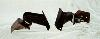
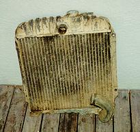

# Project Pieces and Parts - Engine*
by: Terry L. Howe

Buick 231 V6

When I bought my CJ-2A, it had a odd fire Buick 225 in it of unknown vintage. The previous owner said there was a problem with the engine and that is why it was torn down. It was also filled with water, so it didn't look like a good candidate for rebuild.

The Buick V6 engines are excellent engines for a flat fenders and CJ-5s because they are very short and the shorter the drive train, the more drive shaft you get. Drive shaft is in short supply with short Jeeps. Because of this, I decided to stick with a Buick V6.

I ended up purchasing a used even fire Buick 231 V6 for $220. I was told it was out of a '79 Oldsmobile, but I found out later it was actually a '80 engine. The even fire is supposed to idle better and it was convenient to get all the brackets and accessories I wanted on the engine. It had a regular Delco alternator, "ham box" Saginaw power steering pump, and rotary AC compressor all ready to go.

Advanced Adapters engine mounts

In order to mount the 231 on the frame, I got the Buick engine mounts from Advanced Adapters. These engine mounts are elegant and simple in design. They provide plenty of clearance for steering linkage which is a big concern with flat fenders. There is a bolt running through the mount that is dampened with a rubber bushing, so you do not have to worry about the mount separating. They also give the installation a real clean look.

## Fitment

Mount placement

The biggest issue doing an engine and/or transmission swap with a flat fender is drive shaft length. You need to leave as much drive shaft as possible to get a reasonable driveshaft angle. You have to leave at least enough for a CV joint and slip joint. The Buick V6 is of course very short because of the cylinder layout. With 3 cylinders on either side, it is shorter than most I4 engines.

Since I was planning on using an automatic transmission, length was even more of an issue since most automatic transmissions are significantly longer than manual transmissions. The picture above on the right shows the Advanced Adapters engine mounts bolted in place.

## Fan

Fixed fan on 231 V6

The engine I bought had a large clutch type fan. It was a nice fan, but it added substantially to the over all length of the engine. I wanted to used a rigid fan with as large a diameter as possible because cooling automatic transmission can be a real challenge in a four wheeler. Crawling in rocks tends to cause automatic transmissions to heat up. I wanted a rigid fan because I've heard too many horror stories about flex fans pulling into and eating radiators when they hit water.

A buddy of mine gave me a 18", high pitch, fixed, rigid fan. It a appears to be a low end Flex-i-Lite rigid fan. This fan had the potential to save me 3.5" over the original fan on the engine. My after-market fan would not clear the clutch on the AC compressor, so I had to remove the AC compressor. The York compressor clutch does not stick out the same way, so someday I'll get a York compressor on the engine for on-board air.

The fan should get me going at least. I may go with a higher pitch and larger diameter fan in the future. I also need to dig up a fan shroud.

## Radiator

'67 CJ-5 radiator

The radiator that came with my flat fender appeared to be in excellent shape. I dropped it off at a local radiator shop to have a tank installed for the automatic transmission. It turned out it was full of holes and basically messed up beyond repair.

I stopped my Tom Hackle's shop, a local CJ used parts specialist, and since he owed me some favors, he sold me a real nice radiator for $30. The radiator was from a late 60s CJ-5 with Buick V6, so the hose location and size would work well for me. The down side was the bottom of it was too small for an transmission cooler tank. The return on this radiator was right in the middle of the radiator, so I had a radiator shop move the return over to the drivers side corner. This should improve cooling since the coolant will have to flow all the way across the radiator and it will allow me to use a larger fan.

The next step was fabricating a bracket to mount the radiator to my grill. I spaced the radiator 2" from the face of the grill which gave me enough room to fit two 3/4"x7.5"x15.5" transmission coolers in front of the radiator. These coolers are run in series and hopefully they will be sufficient.

## Engine Mounts

After cleaning the engine off at my local car wash, I bolted on the Advanced Adapters engine mounts. I had to grind a little bit of material off the mount to clear the fuel pump. With

A/A engine mounts  the grill bolted in place with the radiator on it, I was able to determine where the engine could go. The idea was to move it as far forward as possible giving at least 1" clearance with the radiator. I also needed to make sure the front drive shaft or axle did not hit the oil pan.

When I had the location figured out, I simply drilled holes in the frame and bolted on the mounts. I may weld the mounts on the frame at a later date when I am sure I happy with the location of the engine.

Another feature of the Advanced Adapters engine mounts is they allow movement of the engine left and right. Four holes are drilled out on each engine side of the mount and the engine can be shifted to the passenger side or drivers side. This allow you to easily adjust for clearance of drive shafts and steering linkage.

## Plumbing and Wiring

Once the engine and radiator were bolted in place, it was a simple matter of plumbing and wiring everything. I was able to bend one of the original hose on the return and for the feed I used a generic hose that was in the flat fender when I bought it. The heater hoses I ran the feed to the return for now. I ran some fuel hose for supply and return to a can of gas to get things started.

I did minimal wiring for now, just enough to get it fired up. I ran a wire to the distributor and to the alternator. The big cap distributor that came with my engine is not computer controlled. The coil, cap, rotor, and advance are all in the distributor, so it has only one wire that is hot when the key is in the run position. The alternator has a sensor and output wire that run to the battery.

## Fuel and Air

When I bought my 231 it had a Rochester Dual Jet carb on top. This carb has an unusual size top, but Dave Ewing was kind enough  to give me a air filter housing off some vehicle with the same carb. The Housing fits great, nice and low down. I should be able to fit the hood on with no hole in it with a small body lift. I didn't want to have a big hood scoop that would get in the way of folding down the windshield.

Headers and glass packs

I'm going to stick with the Rochester Dual Jet carb for now, I'd like to go with fuel injection of some sort some day. The 231 is available with multiport fuel injection, so this swap would be fairly easy and and inexpensive. Only down side is MPI is much more complicated to trouble shoot compared with TBI. For now, the Dual Jet stays and a hose from the fuel pump to a little can of gas feeds it.

## Exhaust

When I bought my CJ-2A, there was a set of Hooker headers in the back for the 225. These headers bolt right up to the Buick 231, so I decided to use them. I just bolted glass packs to the headers for now, but I'll put on some tubes to route the exhaust to the side later on.

## Firing It Up

I changed the oil before I fired it up, but I didn't run new plugs or wires. I wanted to see how the thing would run before I dropped any more money on it. All I did to fire it up was run a hot wire from the battery to the starter to trip the solenoid. It cranked and it fired.