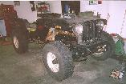
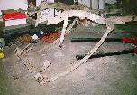

# Project Pieces and Parts - Frame I
by: Terry L. Howe

Test fitting the tub, hood, and grill

Cutting off back of frame

Cross member cut off

Frame welded together outside view

The bumper

The frame on Project Pieces and Parts is probably the most radical work so far. The original frame I got with this Willys was from a '50 CJ-3A and it was badly bent and had numerous welds on it. The rear section was rusted clear through in places. I decided there was no saving it, but kept it just in case.

I happened to stumble across a '73 Commando for next to nothing that was missing the engine and suffered severe fire damage to the interior. I took it apart and sold some and saved some, the brakes I used for the rear axle on Pieces and Parts. The frame was left over and it was in great shape and boxed almost all the way. Obviously, it was too long for a flat fender, but after some measuring, I determined I could use it if I took about 25" out of middle and 8" off the back. I started cutting.

The back end was the easy part, I just cut off about 8" with a circular hand saw. The remaining rear part of the frame turned out to be the same dimensions as the original frame. The Commando uses a spring that was shorter in the front than it is in the back, so the resulting axle position ended being the same. I left the axle bump stop and shock mount where it was. I bolted on the front spring hanger from the original frame on the front and welded it on as well. Originally, it was riveted and welded on. On the rear, I used the cut down shackle hanger from a CJ-7 bolted on.

The Commando has the springs mounted outside of the frame rails, and the shackle hanger was built into the rear cross member. It wasn't worth reusing the original crossmember, so I built my own out of some 4x4x1/4" angle. I happened to pick up a scrap of this cheap at the scrap yard. Since it was heavy gauge, I built a combination cross member and rear bumper. I cut the sides at angles and welded a tab on the back to tie it into the same bolt that attaches the shackle hanger to the frame. Two 1/2" bolts attach it to the top of the frame and two 1/2" bolts go through the bottom of the frame and the shackle hanger. I bolted a shackle hanger to the middle for recovery.

After the rear cross member was squared away, I was ready to chop out the middle to get the proper length. On the inside channel, I was able to cut the channel where it tied into a cross member in from of the axle. This welded back together very clean and looks stock.

The outside channel was cut further toward the middle so that both joints wouldn't be in the same place and it was butt welded together. Once the body is ready to go on, I'll need to weld back on all the body mounts that were cut off. At this time I'll weld on a plate over this cut. Straight vertical welds on frames are said to be prone to cracking, but a fish mouthed plate welded over the cut will distribute the stress horizontally.

The front bumper is minimalist to the extreme. I cut a piece from the same 4"x4"x1/4" angle that I used to fabricate the rear bumper. I cut it a 1/4" longer than the width of the front frame rails and welded small caps over the end. The top of the bumper is held on by a bolt that goes through the winch mount, through the bumper, and then through the frame. The bottom bolt goes through the frame and a small piece of 2"x2"x3/16" angle welded to the back of the bumper just like I'd done on the rear bumper. I managed to cut off an additional 2" from the frame horns to improve the angle of approach. In the middle of the bumper, with just enough clearance for a roller fairlead, is a single shackle bracket.

The 25" cut out of the middle of the frame will not bring the frame specifications for the flat fender, but this is intentional. CJ-2As have a wheel base of about 80" and this frame will have a wheel base of about 83". The crossmember/bumper will stick out about 2" in the rear, but since it is both a crossmember and a bumper, it should look normal. The front axle is moved forward about 1". This was done to gain room for more rear driveshaft and great stability on the trail. An 83" wheelbase is about the same as the AMC version of the CJ-5. After the frame was all together and the springs and axles were all bolted on, my buddy Sean came over and helped me test fit the tub, hood, and grill on the frame to see how it laid out. As you can see from the pictures it looks pretty natural.

**