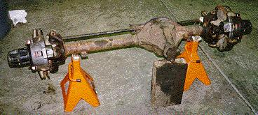
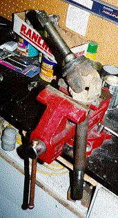

# Project Pieces and Parts - Front Axle*
by: Terry L. Howe

A '72 CJ-5 Dana 30 converted to disk brakes

I decided right from the start to sell off the Dana 25 and Dana 41 that came with my flat fender and replace them with more modern and stronger units. I had heard stories of breakage with the old axles since they use smaller shafts and low spline counts compared to the stronger axles used in the 70s and 80s.

Soon after I purchased the flat fender, I found a '72 CJ-5 in one of those cut and crush junk yards. The good news was the axles where in good shape and had 4.27:1 R&P.; I purchased the front end for $50. I kind of wanted a Dana 44 front end, but the Dana 30 should stand up to the light weight and fairly low horse power of my flat fender. I couldn't beat the price and the '72-'86 CJ Dana 30 is the strongest axle that bolts on to a flat fender without cutting or other major fabrication. The narrow track Dana 30 used from '72-'81 is slightly wider than the Dana 25 and the wide track Dana 30 is wider yet. The width should not be a big issue, the fender will still be over the tires and my turning radius, articulation, and stability should improve.

The down side was the Dana 30 had drum brakes up front and my heart was set on disks up front. I happened to have a Dana 30 from an '81 CJ-5 with disks, but 3.54:1 R&P.; To get the disks and low gears, I decided to upgrade the older Dana 30 to disks.

The disk conversion for the drum Dana 30 is quite simple, no fabrication is required if you have the right parts. The first step is to strip both axles down to just the housing with the gears in place. To do this you must:
- **Remove the hub/lockout:** On Warn premium hubs you have to remove the cap screws and remove the dial. Remove the snap ring on the end of the axle shaft and remove the 6 bolts holding it to the brake hub.
- **Remove the brake hub and drum/rotor:** First, you have to hammer back the locking washer that holds the spindle nut in place. Remove the outside spindle nut, locking washer, inner spindle nut, and inner washer. A 2 1/16" spindle nut socket is the best tool for removing the spindle nut. Pull off the brake hub and drum/rotor.
- **Remove the Spindle:** On the drum brake, you must remove all the springs, shoes, and brake hose at this time. Brake tools pay for themselves when assembling and disassembling drum brakes. Six nuts hold the spindle to the knuckle. Remove these nuts with a 9/16" socket and begin the sometimes ardous task of removing the spindle from the knuckle. On the drum brake version, the backing plate should pull right off this time so you can hammer at the spindle with the backing plate out of the way. Try to get a chisel behind the spindle and/or put an old spindle nut on the end and hit that. You can also strike the spindle on the part in between were the two bearings ride, but if it is stuck firmly, this won't be enough.
- **Pull the Shaft:** Once the spindle has been removed, carefully slide the shaft out.
- **Remove the knuckle:** Remove the cotter pins that lock the ball joint nuts in place and remove the the two nuts. You should be able to pop the knuckle off by hitting it and the ball joint end. An old nut on the end of the ball joint can help protect the end of the ball joints if they are still in good shape.

Once everything is apart, you are ready to put things back together. I did some mixing a matching to get the strongest combination possible. For me, the process for reassembly was slightly complicated for various reasons. The steps follow:

Dana 30 shaft gets a new u-joint

Dana 30 spindles

Drum brake lugs vs. disk brake lugs

Installing new inner bearing seal

**Install Disk Brake Knuckles: ** The first step was to install the knuckles with the caliper bracket. Simply slide the ball joints in place and torque to spec.

**Install Shafts: ** Next I needed to install the shafts. Both set of shafts were of the same length, but the '81 CJ-5 Dana 30 uses a shaft that is slightly thicker between the splines and yoke. For this reason, I decided to go with the newer shafts.

The only problem was, One of the u-joints was badly frozen and needed to be replaced. Replacing the u-joint can be done with a bench vise, socket set, hammer, and screwdriver. The hammer and screwdriver are handy for removing the old rusty clip that retains the u-joint. After the four clips are removed, I use a 11/16" socket and 1" socket to press out the joint one way, remove the cap, and press out the joint the other way to remove the other cap. The little socket goes on the cap to be pressed in and the big socket goes around the cap that is being pressed out. If the joints are stiff, apply pressure and tap the side of the yoke with a hammer to slightly elongate the yoke and the cap will pop.

The other u-joint was in good shape, so I left it in place. The shafts are easy to install, you just slide them in and try not to damage the inner seal.

**Install Spindles: ** After the shafts are in place, the spindles can be installed. The drum brake Dana 30 uses a slightly different spindle than the disk brake version. The disk brake spindle is fatter on the the inside than the drum brake spindle. Since I loaned one of my drum brake spindles to a friend, I opted to use the disk brake spindles. I applied RTV between the spindle and knuckle so they don't rust together. If I had anti-seize at the time, I would have used that.

**Install Brake Hub: ** The '72 CJ-5 used a brake hub for a six bolt lock-out with Warn Premium hubs on it. The '81 CJ-5 used a brake hub for a five bolt lock-out with cheap factory hubs. I wanted to use the old brake hub, this meant I had to swap over the rotor and switch bearings.

The first step in removing the rotor is removing the studs. Put an old lug nut on the lugs and hammer on it until the lug pops out. After all the lugs are removed, the rotor should fall free of the brake hub. The disk brake axle uses a slightly different lug with a long shoulder to go through the rotor.

The reason I had to switch bearings is because I had installed the spindles from the disk brake Dana 30. The disk brake Dana 30 uses a spindle that is fatter on the inside and the same diameter on the outside.
Last Four Digits of Dana 30 Bearings OuterInnerTypeBearingRaceBearingRaceDrum1349131013491310Disk1349131029492910*
My bearings were in good shape, so I just removed them from the disk brake hub, repacked them, and installed them in the drum brake hub. The bearings can be driven out and installed with a screw driver and hammer. There is a channel on the side that should be used to do this so you don't damage the bearing or race. Removing the inner bearing seal almost always destroys it, so I installed new inner bearing seals all around.

Packing the bearings
After the bearings and races were installed, I put the rotor on the older brake hub and set the disk brake lugs in place with a hammer to hold the rotor in place.

Once the rotor and bearings are in place, installing the brake hub is a matter of sliding it over the spindle installing the inner washer, inner nut, and torquing to spec. After the inner nut is installed the locking washer and outer nut are installed, torqued, and the washer is bent over with a screw driver or the like.

**Install Hub/Lock-out: ** Installing the hub/lock-out is a piece of cake, especially with snap ring pliers. With the Warn Premium hubs, slide the hub body over the shaft and put the snap ring on the end o the shaft. Sometimes, prying the shaft behind the knuckle will help get the shaft in place to get the snap ring on. After the snap ring is seated, bolt on the outer piece of the hub/lock-out. After the hubs/lock-outs are installed, you should be done.

Disk brake with new rotor
If you are considering a disk brake upgrade for your 70s CJ with drum brake, I've heard from a few people that the stock master cylinder and proportioning valve work with out modification. I've never tried it myself, but a few people have said it works. I'm planning on using a master cylinder and and swing arm pedal from a '77 CJ-7 with disk brakes and a proportioning valve from a '73 Scout II, but that will come later. I've selected these parts only because I happen to have them. I need to repair the tub before I can plumb the brakes up.