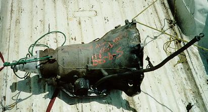
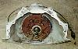
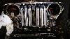

# Project Pieces and Parts - Transmission
by: Terry L. Howe

Turbo 350 side view

The Turbo 350, aka TH350, automatic transmission is a stout 3 speed automatic transmission. It has been used in various GM cars and trucks over the years. Because it is a reliable, common, and short transmission, it is probably the best automatic transmission to swap in a short Jeep such as a flat fender.

Advanced Adapters manufactures a kit to adapt the Turbo 350 to the Dana/Spicer 18 transfer case. With the kit installed, the overall length of the transmission and transfer case is only around 24". This is around 10" longer than the stock T-90 and bell originally in my flat fender, but it workable. If a Buick or Chevy V6 engine is swapped in, the engine can be moved forward to make up some of the extra length. I was swapping in a Buick V6, so I moved the engine as far forward as possible.

## Why an Automatic?

There were several reasons why I decided and automatic transmission was the way to go. Old school four wheelers would say a manual is better because you get engine braking and you can start off on the key. The automatic has several advantages over a manual transmission though and you'll find many hard core four wheelers running automatics today.

**Smooth Engagement: ** One advantage of an automatic is smooth engagement. Even a diaphragm clutch with non-metallic disk cannot provide as smooth as an engagement as a torque converter. A jerky engagement can cause a rollover in the wrong situation and it is easier to maintain control of a vehicle if the driver isn't getting thrown around.

**Simple Installation: ** Obviously, an automatic does not need any clutch linkage. The clutch linkage, particularly on older Jeeps, has a tendency to bind up and sometimes not work if the frame gets twisted up. Older Jeeps can be converted to hydraulic clutches, but this adds to the complexity of a transmission swap. Admittedly, cooling is a bit more of an issue.

**Two Feet: ** With an automatic, there is no need to slip the clutch while you ride the brake with your toes and hit the throttle with your heel. Brake and gas is all you have to worry about. Since driving an automatic is easier, you'll be able to do harder stuff with less stress.

**Effective Crawl Ratio: ** Some argue that automatics are only available with a tall first gears when compared with the heavy duty truck transmissions. This is true, but it does not take into account for the torque converter. The torque converter allows slippage to give an automatic an effectively lower first gear. Clutches tend to be engaged or disengaged.

**Engine Selection: ** Most new cars come with automatic transmissions. Some engines, like my Buick 231 V6 are hard to find with a flywheel on them. Technically this engine needs to be rebalanced if a flywheel is put on where a flex plate once lived. Also, late model engines have computer controlled engines and transmissions. With these engines, it is best to keep a matched engine, computer, and transmission to get all the performance benefits.

**TH350 vs. TH400: ** Some people will argue that a TH400 is everything a TH350 is, but it is stronger. It is a stronger transmission, but there are a couple important advantages to the TH350. The biggest advantage of the TH350 is that is is 3" or 4" shorter than the TH400. It would be very difficult to fit a TH400 in a pre '72 CJ and hard to do for a '72-'83 CJ-5. The couple inches makes a big difference which makes it an excellent choice for a short Jeep. The other advantage is the TH350 is more efficient than the TH400. The Turbo 400 wastes more power than the Turbo 350, so the Turbo 350 will have a snappier feel.

## The Search

The first step is finding a good used transmission. My transmission guy recommended that I purchase a good running transmission because the parts that typically need to be replaced in a core will cost a lot more than the cost of a runner. He ended up locating one for me that only cost $100 with no torque converter. I bought a new torque converter for around $55. Not all Turbo 350s are the same, there are several variations and if you are going to spend the money on a transmission, you might as well find the right one.

**Lock Up vs. Non-Lock Up: ** Newer TH350s use a lock-up torque converter. The advantage of the lock-up is it is more efficient on the highway. When you are in third gear and the RPMs get to a certain level, the distributor triggers the torque converter. This makes the transmission work at a straight 1:1 with no lost power from torque converter slippage. These transmissions are considered to have 3 1/2 gears because of the lock-up.

The down side to the lock-up is the torque converter is not any larger than the non-lock-up version. The clutches take up a lot of space in the converter and so the converter tends to generate more heat. My transmission guy strongly recommended I get a non-lock-up version of the transmission because they last much longer.

The lock up version can be easily identified by the plug it has on the drivers side. It is normally a four prong weather pack plugs, not all the wires are used from what I've seen. The version that does not have a lock up torque converter doesn't have any wires to it at all.

**V8 vs. V6: ** Another variation on the Turbo 350 is the clutch packs. Turbo 350s used with V8 engines use much larger clutch packs than the versions used with six cylinder engines. Since four wheeling tends to be very hard on transmissions, I made sure I got the V8 version with the big clutch packs.

Turbo 350 Chevy tail shaft

**Tailshaft: ** There are several variations on tailshafts. There are long and short tail shafts and the Chevy version uses a different opening for the speedometer output. This won't matter for your Jeep though, because the Advanced Adapters kit replaces the tailshaft. The case on the left has a recently replaced Chevy short tail shaft on it.

**2WD vs. 4WD: ** It is best to get a 4WD version of the Turbo 350 because it will save you some money on the adapter. If you get the 2WD version you will have to pay a couple extra bucks for the right output shaft. The Turbo 350 was used in some full size Blazers and similar trucks. Sometimes people get dual pattern cases built for these trucks so they can drop in Caddy engines.

Turbo 350 dual pattern front

**Bolt Pattern: ** The Turbo 350 case commonly comes with three different bolt patterns. Some cases have a Chevy engine bolt pattern, some cases have the Buick, Olds, Pontiac, and Caddy bolt pattern, and some have both. It is well worth getting the dual pattern, or unicase, Turbo 350. If you ever think you might do an engine swap, you won't have to worry about the transmission. It will also help the resale of the transmission because it will work with more engine combinations.

The Buick, Olds, Pontiac, and Caddy engine bolt pattern is easily identified by the valley at the top and the Chevy pattern is peaked on the top. The dual pattern transmission in the picture on the right has both patterns. You can see the valley and peak. Each set of bolts around the top is in a pair. The alignment pin and the lower bolt is the same.

## The Rebuild

What I ended up buying was a 2WD, V8 version, dual pattern Turbo 350 that did not have a lock-up torque converter. There is no sense in trying to convert a lock-up transmission to a non-locking version or visa-versa because too many parts are different. If you run try to run a lock-up version without hooking up the lock-up, the transmission life will be shortened.

Adapter kit

Since the transmission had to be torn all apart to install the Spicer 18 adapter from Advanced Adapters, I had Dave, my transmission guy, install new clutches and replace any other parts that were worn. The kit includes a new output shaft, a spud shaft with the 6 spline output for the Spicer 18, some bearings, a rear output bearing retainer, assorted o-rings, snap rings, and seals, and a machined plate to bolt the Spicer 18 to the Turbo 350.
I picked up the transmission at Dave's shop and went home to bolt it up. When I tried to bolt on the transfer case, it wouldn't go on because I had a small hole Spicer 18 and the Dave had installed the big hole rear bearing retainer. It turned out the kit from Advanced Adapters only had the big hole bearing retainer in it. I called A/A and they told me I could use the stock bearing retainer for the small hole transfer case.
My buddy Tom Hackle gave me the bearing retainer from a shelled out T-90 and I ran back to Dave's shop to get the correct retainer installed. He switched it around in a matter of minutes. The good part about this little mix up is I know have the big hole bearing retainer, so if I end up swapping on a big hole Spicer 18 or a Dana 20, all I have to do is swap the retainer. If you have a stock T-90 that you can take the bearing retainer from, you'd be better of ordering the big hole version of the adapter. This will make you more flexible for future swaps.

I had to purchase a new torque converter since the transmission I bought didn't have one. According to my transmission guy, it is important to match the torque converter with the engine. Appartently, there are subtle differences between the Chevy and Buick torque converters.

## Installation

Installation was a breeze. I just bolted the torque converter in place, slid on the transmission, and bolted it up.
**Transmission Mount: ** The kit from Advanced Adapters includes a transmission mount and a little adapter for the transmission mount. This worked great with my Commando frame and stock Commando cross member. I drilled new holes in the cross member to work with the new engine and transmission combination.

Transmission mount

Transmission coolers

Turbo 350 installed

The cross member used in the '73 Commando is almost identical to the cross member used in the '50 CJ-3A frame that was originally under my Jeep. The Commando one had some bends in it that gave better clearance for the transfer case, so I decided to use it.

The style of cross member used on these older Jeeps is simple and easy to work with, but they hang down a lot lower than necessary. Eventually, I'll fabricate my own cross member and skid plate that will provide better clearance.

**Hook Up: ** There are two things that control the transmission, vacuum and the kick down cable. A vacuum line runs from the manifold to the governor on the back of the transmission. There was a small line on my engine that appeared to be used for this purpose, so I hooked up the vacuum to this line. The kick down cable runs to the throttle linkage on the carburetor. Since my engine had an automatic before, it was a simple matter to hook this up.

**Cooling: ** Keeping the temperature down for an automatic transmission is crucial to prevent damage. Four wheeling tends to be hard on an automatic transmission as well, so the capacity to keep it cool needs to be greater than it would be on a normal car. Since my radiator did not have a tank, I used two 7.5"x15.5"x3/4" oil coolers mounted in front of the radiator. If these don't provide sufficient cooling, I'll install either a larger cooler yet or go with an external oil cooler that runs off coolant.

## Conclusion

I don't have any real shift linkage for the transmission yet, but I was able to shift the transmission through the gears when I fired up the engine. It seems to shift through all the gears manually with no complaints, but it is hard to see how it will shift until it is under load. The shift points can be modified later if I need to.