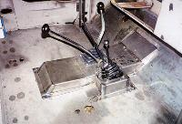

# Project Pieces and Parts - Shift Linkage*
by: Terry L. Howe

Tunnel cover

Fabricating the shift linkage bracket and tunnel cover was an entire weekend of careful cutting, bending, welding, and drilling. The work was worth it, I got the clean look I wanted and I maximized floor space. The key to the success of the project was borrowing a small brake from my neighbor.

## Shift Linkage

To avoid shifting problems caused by frame and tub flex, I wanted all the shift linkage attached to the transmission. I purchased a relatively inexpensive Daytona floor shifter for my Turbo 350. It wasn't gated at all except for park, but it looks good and allows quick shifts. I fabricated a bracket that attaches to the top hole in the transmission and one of the holes on transmission to transfer case adapter. I also used the bracket to attach the shift lever for the Warn Over Drive.

## Tunnel Cover

The tunnel cover was complicated because I was using two fuel tanks, one in the stock location under the drivers seat and one extra one under the passenger seat. I wanted a tunnel cover that was removable, but I didn't want to remove the gas tanks to get it all off. I ended up bending five pieces of metal, two under the tanks and three outside of the tanks. I welded seams from the back side to give them a clean look.

The transmission shifter came with its own shift boot that worked well. When I bought the Scout Dana 18 transfer case, I grabbed the shift boot with it. The Scout 80s and some of the Scout 800s use a real nice twin stick shift boot. I had another one of these shift boots that I cut in half to use as a shift boot for the Warn overdrive. The over drive and transfer case levers required some minor bending to clear the gas tanks and seats.

## Conclusion

The Transfer case shift linkage is kind of intrusive on the passenger side floor, but with some bending of the shift levers, they are pretty much out of the way. The passenger side still has more floor room than the drivers side. A coat of Durabak on top of the tunnel cover gives it a nice finish.

Tunnel cover