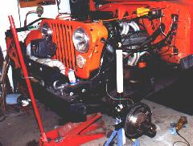
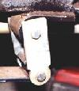
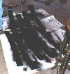
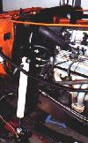

# Building a Custom CJ Front Suspension

 **by John Nutter**

After running the same spring under axle (SUA) setup with a shackle reversal for years, Mike Knorr was ready for a change. His set up performed well, but the springs were getting tired and Mike wanted something that took performance to the extremes. A spring over axle (SOA) conversion was the obvious solution, but Mike didn't want to give up his shackle reversal. This article is the first in a two part series on extreme suspension modifications. It covers what went into his new front suspension including reworking spring mounts, a long travel driveshaft, military wrapped spring packs, custom shock towers for the longest RS9000 shocks available, and high clearance steering with heim joints.

## Spring Mounts

 

Mike wanted to keep his shackle reversal while doing the SOA. His original shackle reversal system was relocated and raised to give a better approach angle. Almost two inches were taken off between the spring eyes and the frame. The bracketry was moved forwards until the main spring eye was directly below the leading edge of the frame.

 Mike fabricated new shack hangers out of heavy gauge tubing and 1/4" x 2 1/2" mild steel. First the edge of the flat stock was welded to the tubing, then it was bent all the way around and welded to itself. After that the gap on each side was welded shut and ground smooth. It looks similar to a standard rear shackle hanger, but it is heavier duty. The shackle hangers were welded to the frame after the shackle position was verified.

## Springs:

 Mike originally tried using some stock CJ rear springs, but they didn't have enough arch for his needs. Next Mike ordered from JC Whitney some heavy duty CJ rear spring packs with military wrap. These springs are real nice springs for the cost. 

 The only down side to these springs is they came with cheesy clamps that would get torn off quickly on rocks. To prevent his packs from fanning out Mike had some riveted on spring clamps added that are similar to what Jeep uses from the factory. While the packs were apart Mike painted them again. 

## Steering:

 Mike designed a custom high clearance steering setup and had a friend who is a machinist fabricate it. It uses mid '70s Wagoneer knuckles and flame cut arms for the drag link and tie rod. Mike used the same setup that I used in my [High Clearance Steering](/steer/soasteering/), except he used 3/4" heim joints with a 40,000 lb tensile strength rating instead of tie rod ends. Mike also used some thick walled DOM tubing for the tie rod and drag link. One end was tapped for right hand threads and one for left to make adjustments easier. The custom steering arms were designed with heim joints in mind, but the pitman arm had to be drilled to fit the bolt. 

## Shock towers and shocks:

Mike had Pat Hegleson at Custom Welding in Williston, ND build these shock towers and cross brace. The original front shock towers were cut off and the new setup was mocked up. With the new shock towers clamped in place jack stands and a floor jack were used to contort the Jeep and test the suspension flex. Opposite corners were raised until a tire came off the ground. Clearances were noted and the position of the shock towers were adjusted. When Mike was happy with the shock tower placement, the shock towers were welded in place. The cross brace uses polyurethane bushings to allow for flex and disassembly in case the motor needs to be removed.

    

## Acknowledgments

I'd like to thank Mike Knorr for letting me shoot pictures while I was supposed to be turning a wrench. I'd also like to thank Myron Hanson for the use of his well equipped shop and expert black smithing and metal working. Pat Hegleson deserves a big thanks for selling Mike the shock towers and Dave Kesky deserves a thank you for doing most of the fabrication on Mike's steering arms.

\