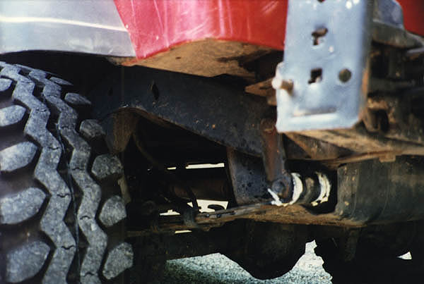
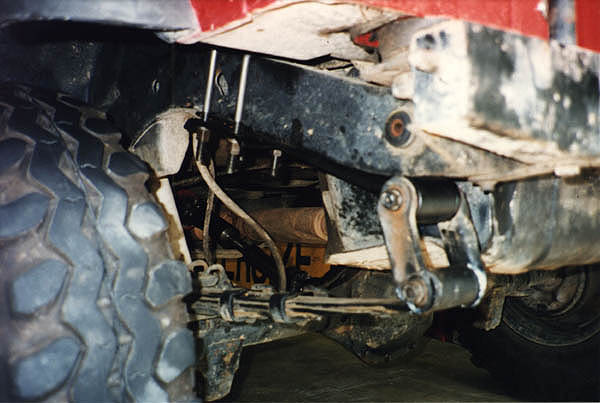
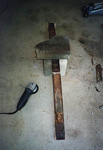
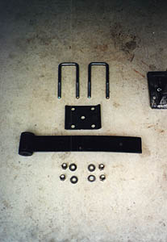
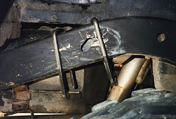
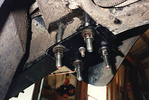
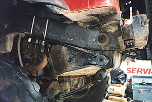

# 3/4 Elliptical Rear Suspension

Before After

Craig Meyer's 3/4 elliptical suspension is surprisingly simple and elegant. The tools to build it can be found in most garages and the parts won't cost an arm and a leg. The following parts are necessary for the project:

  * 2 - Stock Rear CJ Spring Packs (post-'76) or stock YJ Spring Packs (front or rear)
  * 2 - Stock Rear CJ or YJ U-bolt plates
  * 4 - Custom bent U-bolts with washers and nuts

 The first thing to do to make your 3/4 elliptical spring pack is to remove centering pin from CJ spring packs. Next, remove spring clamps that hold the pack together. They may pop apart when the clamps are released. Pull out the main leaves and cut them 5-1/2" from the centering pin towards the small bushing. A hand grinder, or circular saw with metal cutting blade, will make this cut.

 After the main leaf is cut to length, drill a new 3/8" hole 3" in from the cut end. Re-install the centering pin in new hole. After a quick coat of paint, the quarter leaves should be ready for installation.

 Raise the rear of the vehicle so the rear tires are just touching the ground and support with jack stands. Working one side at a time, remove the rear shackle from the frame and spring. Place the quarter leaf spring under frame so bushing and original shackle mount are lined up front to rear. Mark the location of the centering pin on frame and set the quarter leaf aside. Drill a 1/2" hole on bottom of frame for the centering pin. Use a spare 1/2" bolt to line up the U-bolt plate and use the U-bolts to mark the location for holes through the cross member welded inside the frame rail. Drill two 9/16" holes per side in the cross member for u-bolts. Craig had to remove the exhaust to drill the holes through the cross member on the passenger side. Install the U-bolts over frame and through the 9/16" holes.

 Place the quarter leaf spring onto the bottom of the frame and put the centering pin into 1/2" hole. Secure the quarter leaf spring with the U-bolt plates and tighten the U-bolts to 90 ft/lbs. Re-install the shackles to the quarter leaf spring bushing and the original spring bushing.

Craig reports that it took him about 3 hours to do the 3/4 elliptical conversion. On his YJ, he got about 1-1/4" of lift from the conversion, similar to the amount of lift you would get from a shackle lift. Since this lift will turn the pinion upwards, you may be able to remove any shims that were installed for a lift kit. On a CJ, the lift would be next to nothing since the top of the shackle on a CJ mounts on the bottom of the frame.

