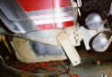

# Wrangler YJ Travel Trick

Before After

I was helping Eric Resko install a Dana 44 rear end in his '87 Wrangler when he showed me a neat trick to increase travel of the rear axle. The rear cross member restricts movement of the rear shackle and some minor trimming of the cross member can greatly increase the movement of the shackle. The before and after pictures above show the dramatic increase in range of motion of the shackle.

The material on the rear cross member inside of the frame rail stops backward movement of the shackle. Eric trimmed the material with an air cut-off wheel, but the work could be done with a saws-all or saber saw. There wasn't enough room to get my circular saw in there. This modification should work for any '87-'95 Wrangler. Look for an article on the YJ/Dana 44 swap in the January '98 issue.