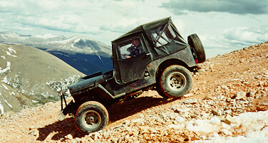

# Trail Report: Big Horn: Red Cone Peak

This trip was only my second trip with Big Horn 4x4. We were planning on doing Twin Cone, but it had been closed. Red Cone had a reputation for being a tough trail, but we managed to get to the top without any problems. The picture above is on the peak of Red Cone which is over 12,000 feet (above the tree line in CO). Leading is Jacob in his Toyota pickup, my CJ is behind him, and Matt's Rover is behind me. Paul's flat fender is on the other side of the Rover. 

Here's a shot of Paul coming off the Peak with Cindy riding shotgun. This hill definitely requires 4 low. 

Here's another club member, Dave Vest, coming down Red Cone in his Early Bronco. 

 After the peak we hit a series of switch backs and this corner gave us a bit of trouble. Jacob got stuck in the snow and ended up at an uncomfortable angle. I plowed into the snow to become a winch point so Dave could snatch him out of the snow. Later on, Bill's Ford Ranger grenaded a hub on this same corner.