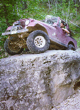
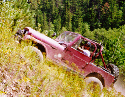
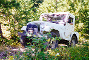

# 1997 Dakota Territory Challenge

 [Iceman](dtc971.md) The first major obstacle was optional and about half the people skipped it, but after that we started hitting obstacles that weren't optional. The [Iceman](dtc971.md) struck fast freezing us in our tracks.   
[Old Miner](dtc972.md)  
After Carbonate, we dropped into Chism Gulch and stopped for lunch at the base of Heckman Hill, aka Widowmaker Hill. Heckman Hill is the most challenging part of the [Old Miner](dtc972.md) and it requires lots of throttle no matter what modifications you may have made to your vehicle.  [Mount Moriah](dtc973.md)  
[Mount Moriah](dtc973.md) starts out with a rocky and muddy hill climb and continues on with some wicked off-camber sections. The hill climb isn't too tough, but the off-camber sections require careful driving. After the off-camber section, I was heading down a steep decent when smoke started pouring out of my dash.